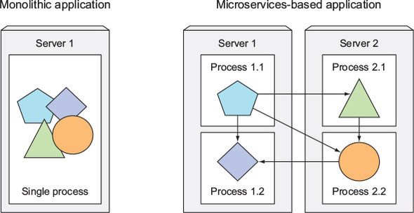
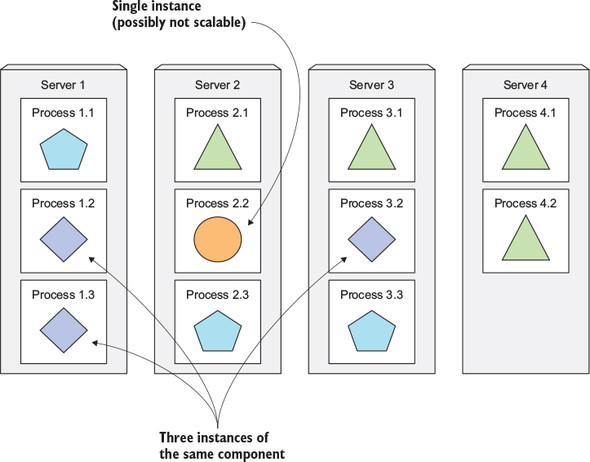
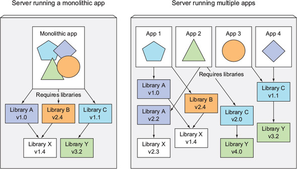
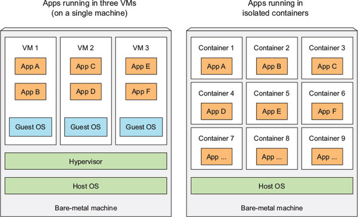
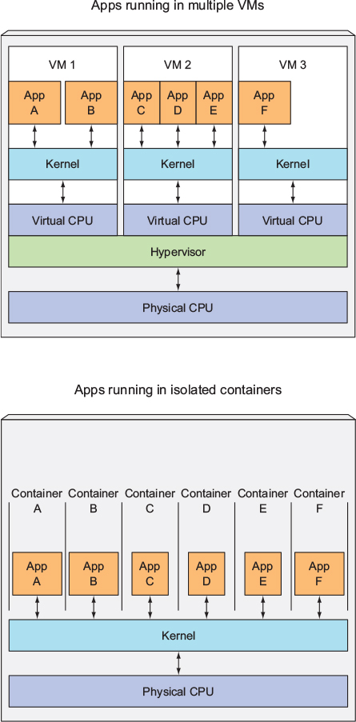

# 1장 쿠버네티스 소개

## 1.1 쿠버네티스와 같은 시스템이 필요한 이유

> 모놀리스 레거시 애플리케이션이 마이크로서비스로 세분화되면서 시스템의 원활한 구성, 관리, 유지가 필요
>
> - 구성 요소의 서버 배포를 자동으로 스케줄링하고 구성, 관리, 장애 처리를 포함한 자동화
> - 하드웨어 장애 발생 시 해당 어플리케이션을 자동으로 모니터링하고 스케줄링 조정

### 모놀리스 애플리케이션에서 마이크로서비스로 전환

#### 마이크로서비스로 애플리케이션 분할

- 마이크로서비스는 독립적인 프로세스로 실행
- 단순하고 잘 정의된 인터페이스로 다른 마이크로서비스와 통신
    - RESTful(Representational State Transfer) API를 제공하는 HTTP와 같은 동기 프로토콜
    - AMQP(Advanced Message Queuing Protocol)와 같은 비동기 프로토콜
- 독립형 프로세스이기 때문에 개별적으로 개발 및 배포 가능

#### 마이크로서비스 확장

- 마이크로서비스 확장은 서비스별로 수행
- 리소스가 더 필요한 서비스만 별도로 확장

#### 마이크로서비스 배포

- 구성 요소가 많아질 수록 배포 조합, 구성 요소 간 상호 종속성 등 배포 관련 결정이 어려움
- 여러 개의 마이크로서비스가 하나의 시스템처럼 동작하도록 구성 필요
- 여러 프로세스와 시스템에 분산된 마이크로서비스의 실행 호출 디버그, 추적이 어려움

#### 환경 요구 사항의 다양성

- 마이크로서비스 아키텍처의 구성 요소는 독립적으로 배포되고 개발됨

### 애플리케이션에 일관된 환경 제공

- 개발 및 배포 시 고려 사항
    - 애플리케이션을 실행하는 환경의 차이
    - 개발과 프로덕션 환경 사이의 차이
    - 각 프로덕션 머신 간의 차이
    - 프로덕션 머신의 환경 변동
- 운영하는 모든 애플리케이션에 적절한 환경 제공 필요
- 동일한 환경에서의 애플리케이션 개발과 프로덕션 실행 필요

### 지속적인 배포로 전환: 데브옵스와 노옵스

> 개발자, 품질 보증(QA), 운영 팀이 애플리케이션 개발, 배포 및 관리 등 전체 프로세스에서 협업하는 데브옵스(DevOps)의 필요성 등장

#### 데브옵스의 장점

- 애플리케이션 운영 시 직면하는 문제를 이해하고 개발에 신속한 피드백 반영 가능

#### 개발자와 시스템 관리자 각자가 최고로 잘하는 것을 하게 하는 것

- 쿠버네티스를 사용하여 하드웨어를 추상화하고 어플리케이션 배포 및 실행을 위한 플랫폼 제공
- 개발자는 애플리케이션 구성, 배포하고 시스템 관리자는 인프라를 유지하고 운영하는 데 집중하도록 도움

## 1.2 컨테이너 기술 소개

> 쿠버네티스는 리눅스 컨테이너 기술을 사용하므로 컨테이너 기본 및 도커나 rkt(rock-it)에 대한 이해 필요

### 컨테이너 이해

- 마이크로서비스 구성 요소가 작아지고 많아질 수록 각각의 구성 요소에 대한 가상 머신을 제공하기 어려움

#### 리눅스 컨테이너 기술로 구성 요소 격리

- 리눅스 컨테이너 기술을 사용하여 각 마이크로서비스의 환경 격리
  - 동일한 호스트 시스템에서 여러 개의 서비스 실행 가능
  - 서로 다른 환경 제공 가능
  - 가상머신에 비해 적은 오버헤드

#### 컨테이너와 가상머신 비교

- 가상머신에 비해 훨씬 가벼움
- 호스트 OS에서 실행되는 하나의 격리된 프로세스로 애플리케이션이 소비하는 리소스만 소비

- 호스트 OS에서 실행되는 동일한 커널에서 시스템 콜을 수행
- 시스템 서비스를 실행하지 않으므로 가상머신처럼 부팅이 필요하지 않음

#### 컨테이너 격리를 가능하게 하는 메커니즘 소개

- 리눅스 네임스페이스: 시스템(파일, 프로세스, 네트워크 인터페이스, 호스트 이름 등)에 대한 독립된 뷰로 제한
- 리눅스 컨트롤 그룹: 리소스(CPU, 메모리, 네트워크 대역폭 등) 제한

#### 리눅스 네임스페이스로 프로세스 격리

- 모든 시스템 리소스(파일시스템, 프로세스 ID, 사용자 ID, 네트워크 인터페이스 등)는 하나의 네임스페이스에 속하지만, 추가 네임스페이스를 생성하여 리소스 구성 가능
- 프로세스는 네임스페이스 중 하나에서 실행되며, 해당 네임스페이스 내에 있는 리소스만 사용 가능
- 프로세스는 여러 네임스페이스에 속할 수 있음
- 네임스페이스 종류
  - 마운트(mnt)
  - 프로세스 ID(pid)
  - 네트워크(net)
  - 프로세스 간 통신(ipc)
  - 호스트와 도메인 이름(uts)
  - 사용자 ID(user)
- 네임스페이스는 특정 리소스 그룹을 격리하는 데 사용됨

#### 프로세스의 가용 리소스 제한

- 리눅스 커널 기능인 cgroups을 사용하여 컨테이너가 사용할 수 있는 시스템 리소스 양 제한

### 도커 컨테이너 플랫폼 소개