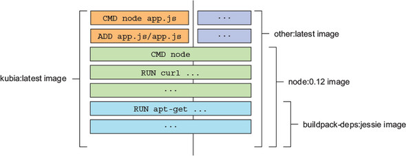

# 2장 도커와 쿠버네티스 첫걸음

## 2.1 도커를 사용한 컨테이너 이미지 생성, 실행 공유하기

### 도커 설치와 Hello World 컨테이너 실행하기

- [https://docs.docker.com/engine/install/](https://docs.docker.com/engine/install/) 또는 brew를 사용해 도커 설치

#### Hello world 컨테이너 실행하기

- docker run 커맨드를 사용해 어떤 이미지를 다운로드하고 실행할 지 기술
- 필요할 경우 다른 명령어 추가 기술

```shell
$ docker run busybox echo "Hello World"
```

- 애플리케이션은 컨테이너 내부에서 실행되고, 컴퓨터에서 실행 중인 다른 모든 프로세스로부터 완전히 격리됨

#### 백그라운드에서 일어난 동작 이해하기

- busybox:latest 이미지가 로컬 컴퓨터에 존재하는지 확인
- 이미지가 없을 경우 docker.io의 도커 허브 레지스트리에서 이미지 다운로드
- 이미지로부터 컨테이너 생성 후 컨테이너 내부에서 명령어 실행
- 프로세스 중단 및 컨테이너 중지


#### 다른 이미지 실행하기

- [http://hub.docker.com에](http://hub.docker.com에) 공개된 이미지 검색 후 다음과 같이 이미지 실행

```shell
$ docker run <image>
```

#### 컨테이너 이미지에 버전 지정하기

- 이미지 참조 시 명시적으로 태그를 지정하지 않을 경우 latest 태그 참조
- 이미지 이름에 태그를 같이 지정하여 다른 버전의 이미지 실행 가능

```shell
$ docker run <image>:<tag>
```

### 간단한 node.js 애플리케이션 생성하기

- HTTP 요청을 받아 애플리케이션이 실행 중인 머신의 호스트 이름을 응답으로 반환하는 간단한 애플리케이션 작성

```js
const http = require('http');
const os = require('os');

console.log("Kubia server starting...");

var handler = function(request, response) {
  console.log("Received request from " + request.connection.remoteAddress);
  response.writeHead(200);
  response.end("You've hit " + os.hostname() + "\n");
};

var www = http.createServer(handler);
www.listen(8080);
```

- 애플리케이션은 호스트 머신의 호스트 이름을 바라보는 것이 아니라 애플리케이션이 실행 중인 컨테이너 내부의 호스트 이름을 바라봄

### 이미지를 위한 Dockerfile 생성

- 이미지 패키징을 위해 Dockerfile 생성 필요
- 도커가 이미지를 생성하기 위해 수행해야 할 지시 사항
- 애플리케이션과 동일한 디렉터리에 있어야 함

```dockerfile
FROM node:7
ADD app.js /app.js
ENTRYPOINT ["node", "app.js"]
```

- FROM: 시작점(이미지 생성의 기반이 되는 기본 이미지)으로 사용할 컨테이너 이미지 정의
- ADD: 로컬 디렉터리의 app.js 파일을 이미지의 루트 디렉터리에 동일한 이름으로 추가
- ENTRYPOINT: 이미지를 실행했을 때 수행돼야 할 명령어 정의

#### 컨테이너 이미지 생성

- docker build 명령을 사용해 이미지 빌드

```shell
$ docker build -t kubia .
```


#### 어떻게 이미지가 빌드되는지 이해하기

- 디렉터리의 전체 콘텐츠가 도커 데몬에 업로드되고 이미지가 빌드됨
- 빌드 중 이미지가 사용자 컴퓨터에 없을 경우, 기본 이미지를 퍼블릭 이미지 리포지터리에서 가져옴

#### 이미지 레이어에 관해 이해하기

- 이미지는 여러 개의 레이어로 구성
- 서로 다른 이미지가 여러 개의 레이어를 공유할 수 있음
- 동일한 기본 이미지를 이용하여 다수의 이미지를 생성하더라도 기본 이미지를 구성하는 모든 레이어는 한 번만 저장
- 각 레이어를 개별적으로 다운로드하며, 저장되지 않은 레이어만 다운로드함
- 이미지 빌드 시 레이어 구성
    - 기본 이미지의 모든 레이어를 가져옴
    - app.js 파일을 추가할 새로운 레이어 생성
    - 이미지가 실행할 때 수행되야 할 명령을 지정하는 새로운 레이어 추가, latest 태그 지정



- 빌드 프로세스 완료 후 새로운 이미지가 로컬에 저장되며, docker images 명령을 사용해 목록 조회

```shell
$ docker images
```

#### Dockerfile을 이용한 이미지 빌드와 수동 빌드 비교하기

- 기존 이미지에서 컨테이너를 실행하고 컨테이너 내부에서 명령어를 수행한 후 빠져나와 최종 상태를 새로운 이미지로 커밋하여 수동 생성 가능
- Dockerfile을 이용하는 것이 반복 가능하고 빌드 자동화 할 수 있는 방법

### 컨테이너 이미지 실행

- docker run 명령어를 사용해 이미지 실행

```shell
$ docker run --name kubia-container -p 8080:8080 -d kubia
```

- kubia 이미지에서 kubia-container라는 이름의 새로운 컨테이너 실행
- -d 플래그를 사용해 콘솔에서 분리돼 백그라운드에서 실행 가능
- 로컬 머신의 8080포트가 컨테이너 내부의 8080포트와 매핑됨

<aside>
⚠️ 로컬 머신에서 도커 데몬이 실행 중이 아닐 경우 [localhost](http://localhost) 대신 데몬이 실행 중인 가상머신의 호스트 이름이나 IP를 사용하여 접근해야 함 (DOCKER_HOST 환경변수로 확인)
</aside>

#### 애플리케이션 접근하기

```shell
$ curl localhost:8080
```

#### 실행 중인 모든 컨테이너 조회하기

```shell
$ docker ps
```

#### 컨테이너에 관한 추가 정보 얻기

```shell
docker inspect kubia-container
```

### 실행 중인 컨테이너 내부 탐색하기

#### 실행 중인 컨테이너 내부에서 셸 실행하기

- docker exec 명령어를 사용해 컨테이너 내부에서 셸 실행

```shell
$ docker exec -it kubia-container bash
```

- -i: 표준 입력(STDIN)을 오픈한 상태로 유지
- -t: 의사(pseudo) 터미널(TTY) 할당

#### 내부에서 컨테이너 탐색

- 컨테이너 내부에 실행 중인 프로세스를 조회하면 호스트 운영체제의 다른 프로세스는 표시되지 않음

```shell
$ ps aux
```

#### 호스트 운영체제에서 실행 중인 컨테이너에서 실행되는 프로세스 이해하기

- 호스트 운영체제의 프로세스를 조회하면 컨테이너에서 실행 중인 프로세스 확인 가능

```shell
$ ps aux | grep app.js
```

<aside>
⚠️ 맥 또는 윈도우 사용 시 도커 데몬이 실행 중인 가상머신에 로그인해야 프로세스 확인 가능
</aside>

#### 격리된 컨테이너 파일시스템

- 각 컨테이너는 격리된 파일시스템을 가짐
- 컨테이너 내부에서 디렉터리를 조회하면 컨테이너 안의 파일(기본 이미지의 시스템 디렉터리, 이미지 생성 시 추가한 파일)만 확인됨

<aside>
ℹ️ 실행 중인 컨테이너에 진입하는 것은 컨테이너에 실행 중인 애플리케이션을 디버깅 할 때 유용
</aside>

### 컨테이너 중지와 삭제

- docker stop 명령어를 사용해 애플리케이션 종료

```shell
$ docker stop kubia-container
```

- 컨테이너에 실행 중인 메인 프로세스를 중지하여 컨테이너 중지
- docker ps 명령에 -a 옵션을 사용하여 실행 중인 컨테이너와 중지된 모든 컨테이너 확인
- 컨테이너를 완전히 삭제하기 위해서는 docker rm 명령을 수행

```shell
$ docker rm kubia-container
```

### 이미지 레지스트리에 이미지 푸시

- 로컬 컴퓨터가 아닌 다른 컴퓨터에서도 실행하기 위해 외부 이미지 저장소에 푸시
- 사설 이미지 레지스트리 설정도 가능하나, 공개적으로 사용할 수 있는 도커 허브에 푸시
    - 기타 레지스트리: Quay.io, 구글 컨테이너 레지스트리(Google Container Registry)

#### 추가 태그로 이미지 태그 지정

- docker tag 명령을 사용해 이미지 태그 지정

```shell
$ docker tag kubia luksa/kubia
```

<aside>
⚠️ 도커 허브는 이미지의 리포지터리 이름이 도커 허브 ID로 시작해야만 이미지 푸시 가능
</aside>