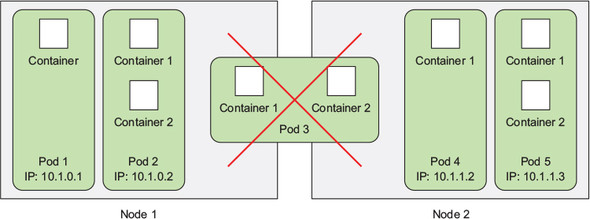
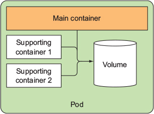
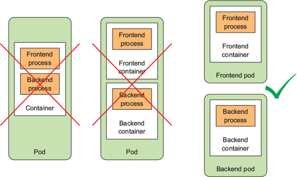
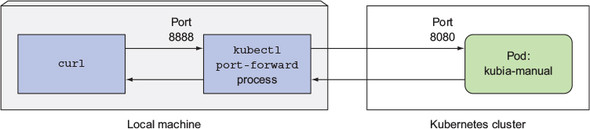
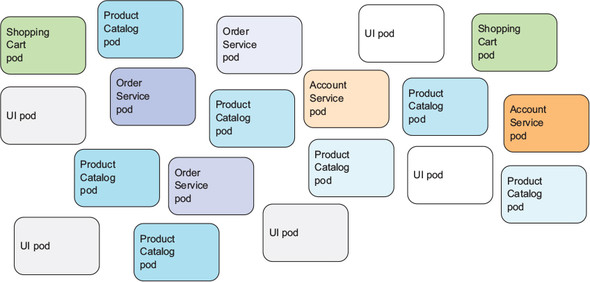
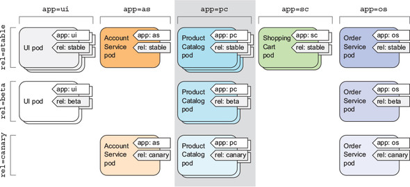
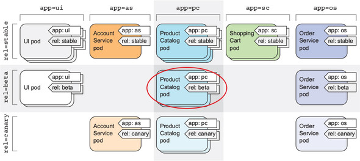
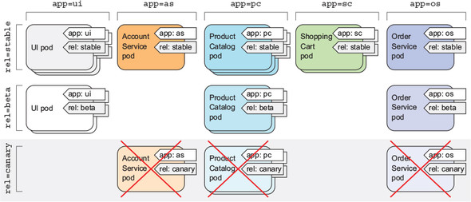

# 3장 파드: 쿠버네티스에서 컨테이너 실행

## 3.1 파드 소개

- 파드는 함께 배치된 컨테이너 그룹으로, 쿠버네티스의 기본 빌딩 블록



### 파드가 필요한 이유

#### 여러 프로세스를 실행하는 단일 컨테이너보다 다중 컨테이너가 나은 이유

- 컨테이너는 단일 프로세스를 실행하는 목적으로 설계
- 단일 컨테이너에서 관련 없는 다른 프로세스를 실행하는 경우 모든 관리 포인트는 사용자 책임
- 로그 기록 시 동일한 표준 출력으로 로그를 기록하기 때문에 어떤 프로세스가 남긴 로그인지 파악 어려움

### 파드 이해하기

- 여러 프로세스를 단일 컨테이너로 묶지 않기 때문에, 컨테이너를 함께 묶고 하나의 단위로 관리할 수 있는 또 다른 상위 구조가 필요

#### 같은 파드에서 컨테이너 간 부분 격리

- 개별 컨테이너가 아닌 컨테이너 그룹 분리
- 그룹 안에 있는 컨테이너가 특정한 리소스를 공유하기 위해 완벽하게 격리되지 않도록 함
- 동일한 리눅스 네임스페이스를 공유하도록 도커 설정
- 모든 컨테이너는 같은 호스트 이름과 네트워크 인터페이스를 공유

<aside>
⚠️ 파일시스템의 경우는 컨테이너 이미지에서 나오기 때문에 다른 컨테이너와 분리되며, 볼륨을 이용해서 특정 디렉터리를 공유하는 것은 가능
</aside>

#### 컨테이너가 동일한 IP와 포트 공간을 공유하는 방법

- 파드 안의 컨테이너가 동일한 네트워크 네임스페이스에서 실행되기 때문에, 실행 중인 프로세스가 같은 포트 번호를 사용하지 않도록 주의
- 각 파드는 서로 다른 포트 공간을 사용하기 때문에 같은 IP와 포트를 공유하지 않음
- 파드 안에 있는 모든 컨테이너들은 로컬호스트를 통해 서로 통신 가능

#### 파드 간 플랫 네트워크 소개

- 클러스터의 모든 파드는 하나의 플랫한 공유 네트워크 주소 공간에 상주


자세한 내용은 [https://coffeewhale.com/k8s/network/2019/04/19/k8s-network-01/](https://coffeewhale.com/k8s/network/2019/04/19/k8s-network-01/) 참고

- 파드 안에 있는 컨테이너는 NAT 없는 플랫 네트워크를 통해 서로 통신 가능
- 파드는 고유 IP를 가지며 모든 다른 파드에서 접속 가능

### 파드에서 컨테이너의 적절한 구성

- 애플리케이션을 여러 파드로 구성하고, 각 파드에는 밀접하게 관련 있는 구성 요소나 프로세스만 포함

#### 다계층 애플리케이션을 여러 파드로 분할

- ex. 웹 서버와 데이터베이스가 같은 머신에서 실행돼야 하는가?
  파드를 두 개로 분리하면 쿠버네티스가 프론트엔드를 한 노드로 그리고 백엔드는 다른 노드에 스케줄링해 인프라스트럭처의 활용도를 향상시킬 수 있음

#### 개별 확장이 가능하도록 여러 파드로 분할

- 파드는 스케일링의 기본 단위
- 쿠버네티스는 개별 컨테이너를 수평으로 확장할 수 없고 전체 파드를 수평으로 확장
- 컨테이너를 개별적으로 스케일링하기 위해 별도 파드에 배포

#### 파드에서 여러 컨테이너를 사용하는 경우

- 애플리케이션이 주요 프로세스와 하나 이상의 보완 프로세스로 구성된 경우



- 사이드카 컨테이너의 예: 로그 로테이터 및 수집기, 데이터 프로세서, 통신 어댑터 등

#### 파드에서 여러 컨테이너를 사용하는 경우 결정

- 컨테이너를 함께 실행해야 하는가, 혹은 서로 다른 호스트에서 실행할 수 있는가?
- 여러 컨테이너가 모여 하나의 구성 요소를 나타내는가, 혹은 개별적인 구성 요소인가?
- 컨테이너가 함께, 혹은 개별적으로 스케일링돼야 하는가?



## 3.2 YAML 또는 JSON 디스크립터로 파드 생성

> 일반적으로 쿠버네티스 REST API 엔드포인트에 JSON 혹은 YAML 메니페스트를 전송해 생성

### 기존 파드의 YAML 디스크립터 살펴보기

- kubectl get 명령과 함께 -o yaml 옵션을 사용해 파드의 전체 YAML 정의 확인
  - YAML 디스크립터에서 사용한 쿠버네티스 API 버전
  - 쿠버네티스 오브젝트/리소스 유형
  - 파드 메타데이터(이름, 레이블, 어노테이션 등)
  - 파드 정의/내용(파드 컨테이너 목록, 볼륨 등)
  - 파드와 그 안의 여러 컨테이너의 상세한 상태

#### 파드를 정의하는 주요 부분 소개

- YAML에서 사용하는 쿠버네티스 API 버전과 YAML이 설명하는 리소스 유형
  - Metadata: 이름, 네임스페이스, 레이블 및 파드에 관한 기타 정보
  - Spec: 파드 컨테이너, 볼륨, 기타 데이터 등 파드 자체에 관한 실제 명세
  - Status: 파드 상태, 각 컨테이너 설명과 상태, 파드 내부 IP, 기타 기본 정보 등 현재 실행 중인 파드에 관한 현재 정보

### 파드를 정의하는 간단한 YAML 정의 작성하기

```yaml
apiVersion: v1
kind: Pod
metadata:
	name: kubia-manual
spec:
	containers:
	- image: luksa/kubia
		name: kubia
		ports:
		- containerPort: 8080
			protocol: TCP
```

#### 컨테이너 포트 지정

- 스펙에 포트를 명시적으로 나열하지 않아도 다른 파드에서 접속 가능
- 포트를 명시적으로 정의할 경우 노출한 포트 확인이 가능하며, 포트에 이름을 지정해 편리하게 사용 가능

### kubectl create 명령으로 파드 만들기

- kubectl create 명령을 사용해 YAML 또는 JSON 파일로 파드 생성

```shell
$ kubectl create -f kubia-manual.yaml
```

#### 실행 중인 파드의 전체 정의 가져오기

- kubectl get po kubia-manual -o yaml 명령을 사용해 파드의 전체 정의 확인

```shell
$ kubectl get po kubia-manual -o yaml
$ kubectl get po kubia-manual -o json
```

#### 파드 목록에서 새로 생성된 파드 보기

- kubectl get pods 명령을 사용해 파드 목록 확인

### 애플리케이션 로그 보기

- docker logs <container id> 명령을 통해 컨테이너 로그를 가져옴

#### kubectl logs를 이용해 파드 로그 가져오기

- kubectl logs 명령을 사용해 파드 로그 확인

```shell
$ kubectl logs kubia-manual
```

#### 컨테이너 이름을 지정해 다중 컨테이너 파드에서 로그 가져오기

- kubectl logs 명령에 -c <컨테이너 이름> 옵션을 사용해 컨테이너 로그 확인

```shell
$ kubectl logs kubia-manual -c kubia
```

<aside>
⚠️ 현재 존재하는 파드의 컨테이너 로그만 가져올 수 있으며, 파드가 삭제된 후에도 파드의 로그를 보기 위해서는 모든 로그를 중앙 저장소에 저장하는 클러스터 전체의 중앙집중식 로깅 설정 필요
</aside>

### 파드에 요청 보내기

- 포트 포워딩(port forwarding)을 통해 파드 테스트 및 디버깅 목적으로 연결 가능

#### 로컬 네트워크 포트를 파드의 포트로 포워딩

- kubectl port-forward 명령을 사용해 포트 포워딩 구성

```shell
$ kubectl port-forward kubia-manual 8888:8080
```

#### 포트 포워딩을 통해 파드 연결

- curl을 이용해 해당 파드에 HTTP 요청

```shell
curl localhost:8888
```



## 3.3 레이블을 이용한 파드 구성

- 파드 수가 증가함에 따라 파드를 부분 집합으로 분류 필요하며, 레이블(labels)을 통해 파드 및 쿠버네티스 오브젝트 조직화



### 레이블 소개

- 리소스에 첨부하는 K-V 쌍으로, 레이블 셀럭터를 사용해 리소스 선택 시 활용


### 파드를 생성할 때 레이블 지정

```yaml
apiVersion: v1
kind: Pod
metadata:
	name: kubia-manual-v2
	labels:
		creation_method: manual
		env: prod
sepc:
	containers:
	- image: luksa/kubia
		name: kubia
		ports:
		- containerPort: 8080
			protocol: TCP
```

```shell
$ kubectl create -f kubia-manual-with-labels.yaml
```

- kubectl get po 명령에 —show-labels 스위치를 사용해 레이블 확인

```shell
$ kubectl get po --show-labels
```

- -L 스위치를 지정하여 특정 레이블에 해당하는 파드만 확인

```shell
$ kubectl get po -L creation_method,env
```

### 기존 파드 레이블 수정

- kubectl label 명령을 사용해 파드에 레이블 추가

```shell
$ kubectl label po kubia-manual creation_method=manual
```

- kubectl label 명령을 사용해 파드의 레이블 변경

```shell
$ kubectl label po kubia-manual-v2 env=debug --overwrite
```

## 3.4 레이블 셀렉터를 이용한 파드 부분 집합 나열

- 레이블 셀렉터는 특정 레이블로 태그된 파드의 부분 집합을 선택해 원하는 작업 수행
- 레이블 셀렉터의 리소스 선택 기준
  - 특정한 키를 포함하거나 포함하지 않는 레이블
  - 특정한 키와 값을 가진 레이블
  - 특정한 키를 갖고 있지만, 다른 값을 가진 레이블

### 레이블 셀렉터를 사용해 파드 나열

```shell
$ kubectl get po -l creation_method=manual
```

```shell
$ kubectl get po -l env
```

```shell
$ kubectl get po -l '!env'
```

```shell
$ kubectl get po -l creation_method!=manual
```

```shell
$ kubectl get po -l env in (prod,devel)
```

```shell
$ kubectl get po -l env notin (prod,devel)
```



### 레이블 셀렉터에서 여러 조건 사용

- 레이블 셀렉터는 쉼표로 구분된 여러 기준을 포함하는 것이 가능



## 3.5 레이블과 셀렉터를 이용해 파드 스케줄링 제한

- 노드 레이블과 레이블 셀렉터를 통해 필요한 노드 요구 사항을 기술하고 쿠버네티스가 요구 사항을 만족하는 노드를 선택하도록 함

### 워커 노드 분류에 레이블 사용

```shell
$ kubectl label node gke-kubia-85f6-node-0rrx gpu=true
```

```shell
$ kubectl get nodes -l gpu=true
```

### 특정 노드에 파드 스케줄링

- 스케줄러가 특정 라벨이 설정된 노드를 선택하도록 요청하기 위해, 파드의 YAML 파일에 노드 셀렉터 추가

```yaml
apiVersion: v1
kind: Pod
metadata:
	name: kubia-gpu
spec:
	nodeSelector:
		gpu: "true"
	containers:
	- image: luksa/kubia
		name: kubia
```

- 파드를 생성할 때 스케줄러는 gpu=true 레이블을 가지고 있는 노드 중에서 선택
- gpu=true 레이블을 가진 노드가 없을 경우 파드가 생성되지 않고 pending 상태로 남아있을 수 있음

### 하나의 특정 노드로 스케줄링

<aside>
⚠️ 파드를 특정한 노드로 스케줄링 가능하지만, nodeSelector에 실제 호스트 이름을 지정할 경우에 해당 노드가 오프라인 상태인 경우 파드가 스케줄링되지 않을 수 있음
</aside>

## 3.6 파드에 어노테이션 달기

- 파드 및 오브젝트는 레이블 외 어노테이션 설정 가능
  - 레이블과의 차이점
    - 식별 정보를 갖지 않음
    - 오브젝트를 묶는 데 사용할 수 없음
    - 레이블 셀렉터와 같은 어노테이션 셀렉터가 없음
    - 레이블에 비해 훨씬 더 많은 정보를 보유할 수 있음
- 일반적으로 쿠버네티스에 새로운 기능을 추가할 때 흔히 사용되며, 파드나 다른 API 오브젝트에 설명을 추가하는 용도로 사용
- 다른 도구, 라이브러리에 의해서 덮어써질 수 있기 때문에, 고유한 접두사를 관리하는 것을 권장
- 어노테이션이 활용되는 사례는 아래 링크 참고
  - [https://kubernetes.io/docs/concepts/services-networking/service/#internal-load-balancer](https://kubernetes.io/docs/concepts/services-networking/service/#internal-load-balancer)
  - [https://skasha.tistory.com/91](https://skasha.tistory.com/91)

### 오브젝트의 어노테이션 조회

- kubectl describe 명령 사용 또는 YAML 전체 내용을 요청

```shell
$ kubectl get po kubia-zxzij -o yaml
```

### 어노테이션 추가 및 수정

- kubectl annotate 명령을 사용해 어노테이션 추가

```shell
$ kubectl annotate pod kubia-manual mycompany.com/someannotation="foo bar"
```

- kubectl describe 명령을 사용해 어노테이션 확인

```shell
$ kubectl describe pod kubia-manual
```

## 3.7 네임스페이스를 사용한 리소스 그룹화

- 레이블을 이용해 파드와 오브젝트를 그룹으로 묶을 경우 오브젝트 그룹이 겹칠 수 있기 때문에, 겹치지 않는 그룹으로 분할하기 위해 쿠버네티스 네임스페이스로 그룹화

### 네임스페이스의 필요성

- 많은 구성 요소를 가진 복잡한 시스템을 좀 더 작은 개별 그룹으로 분리
- 리소스를 분리하는 데 사용(리소스 이름은 네임스페이스 안에서만 고유하면 됨)

### 다른 네임스페이스와 파드 살펴보기

- kubectl get ns 명령을 사용해 모든 네임스페이스 목록 확인
- kubectl get 명령에 —namespace 스위치를 사용해 특정 네임스페이스의 오브젝트 목록 확인

```shell
$ kubectl get po --namespace kube-system
```

- 네임스페이스를 사용해 서로 관계없는 리소스를 겹치지 않는 그룹으로 분리
- 특정 사용자가 지정된 리소스에 접근할 수 있도록 허용하고, 컴퓨팅 리소스 제한 가능

### 네임스페이스 생성

#### YAML 파일에서 네임스페이스 생성

```yaml
apiVersion: v1
kind: Namespace
metadata:
	name: custom-namespace
```

- kubectl create 명령을 사용해 네임스페이스 생성

```shell
$ kubectl create -f custom-namepsace.yaml
```

#### kubectl create namesapce 명령으로 네임스페이스 생성

```shell
$ kubectl create namespace custom-namespace
```

### 다른 네임스페이스의 오브젝트 관리

- metadata 섹션에 namespace 항목을 넣거나 kubectl create 명령을 사용할 때 네임스페이스를 지정하여 네임스페이스 안에 리소스 생성

```shell
$ kubectl create -f kubia-manual.yaml -n custom-namespace
```

<aside>
⚠️ 특정 네임스페이스 안에 있는 오브젝트를 나열하거나 어노테이션 달기, 수정 또는 삭제할 때 —namespace 또는 -n 플래그를 전달해야 함. 지정하지 않을 경우 기본 네임스페이스에서 작업이 수행됨.
</aside>

### kubectl 컨텍스트

- kubectl 명령을 수행할 때 사용할 클러스터, 사용자, 디폴트 네임스페이스를 묶어주는 정보
- 컨텍스트 정보는 ~/.kube/config에 저장됨
- 컨텍스트 전환

```shell
$ kubectl config use-context <<context name>>
```

```shell
$ kubectx <<context name>>
```

- 다른 네임스페이스로 빠르게 전환하기 위해 별칭(alias) 설정 가능
  - alias kcd='kubectl config set-context $(kubectl config current-context) —namespace '
  - 별칭을 설정하면 kcd some-namespace 명령을 이용해 네임스페이스 전환 가능

### 네임스페이스가 제공하는 격리 이해

- 네임스페이스를 사용할 경우 실행 중인 오브젝트에 대한 격리는 제공하지 않음
  - ex. 서로 다른 네임스페이스에 배포된 파드끼리 통신할 수 없는 것은 아님

## 3.8 파드 중지와 제거

### 이름으로 파드 삭제

- kubectl delete 명령을 사용해 파드 삭제

```shell
$ kubectl delete po kubia-gpu
```

- 파드 삭제 프로세스
  - SIGTERM 신호를 프로세스에 보내고 지정된 시간(기본값 30초) 동안 대기
  - 타임아웃 발생 시 SIGKILL 신호를 통해 종료

### 레이블 셀렉터를 이용한 파드 삭제

- kubectl delete 명령에 -l 옵션을 사용하여 특정 레이블의 모든 파드 삭제

```shell
$ kubectl delete po -l creation_method=manual
```

```shell
$ kubectl delete po -l rel=canary
```



### 네임스페이스를 삭제한 파드 제거

- kubectl delete 명령을 사용해 네임스페이스 전체(파드는 네임스페이스와 함께 자동적으로 삭제) 삭제

```shell
$ kubectl delete ns custom-namespace
```

### 네임스페이스를 유지하면서 네임스페이스 안에 있는 모든 파드 삭제

- kubectl delete 명령에 —all 옵션을 사용해 현재 네임스페이스에 있는 모든 파드 삭제

```shell
$ kubectl delete po -all
```

<aside>
⚠️ 레플리케이션컨트롤러에 의해 생성된 파드를 삭제하면 즉시 새로운 파드가 생성되며, 파드를 삭제하기 위해서는 레플리케이션컨트롤러도 삭제해야 함
</aside>

### 네임스페이스에서 (거의) 모든 리소스 삭제

```shell
$ kubectl delete all --all
```

<aside>
⚠️ 시크릿 등 특정 리소스는 보존되며, 명시적으로 삭제 필요
</aside>

<aside>
⚠️ kubectl delete all —all 명령은 kubernetes 서비스도 삭제하지만 잠시 후에 자동으로 다시 생성
</aside>