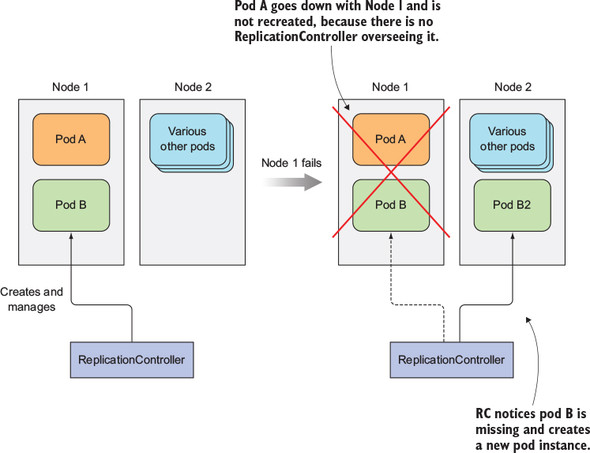
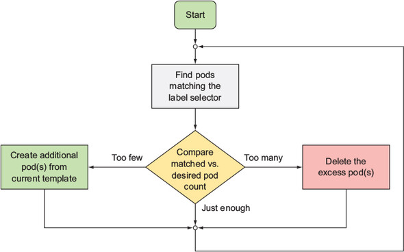
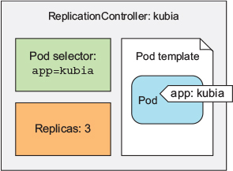
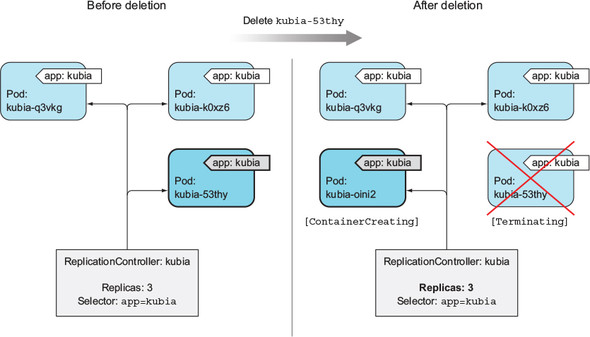
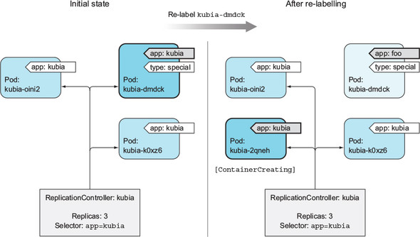
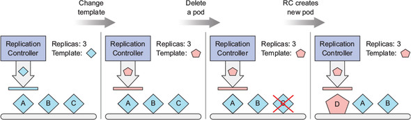
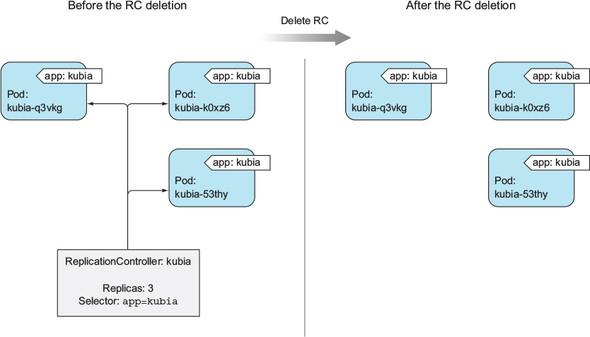

# 4장 레플리케이션과 그 밖의 컨트롤러: 관리되는 파드 배포

## 4.1 파드를 안정적으로 유지하기

- 파드가 노드에 스케줄링되는 즉시, 해당 노드의 Kubelet은 파드의 컨테이너를 실행하고 파드가 존재하는 한 컨테이너가 계속 실행되게 하며, 컨테이너의 주 프로세스에 크래시가 발생할 경우 컨테이너를 재시작함

### 라이브니스 프로브 소개

- 컨테이너가 살아 있는지 확인하는 역할
- 파드의 스펙에 각 컨테이너의 라이브니스 프로브 지정 가능
- 쿠버네티스는 주기적으로 프로브를 실행하고 프로브가 실패할 경우 컨테이너 재시작
- 프로브 실행 메커니즘
  - HTTP GET 프로브: 지정한 IP 주소, 포트, 경로에 HTTP GET 요청을 수행하여 응답 코드가 오류를 나타내지 않는 경우 프로브 성공, 오류 응답 코드를 반환하거나 응답하지 않을 경우 컨테이너 재시작
  - TCP 소켓 프로브: 지정된 포트에 TCP 연결을 시도하여 성공하면 프로브 성공, 실패할 경우 컨테이너 재시작
  - Exec 프로브: 임의의 명령을 실행하고 명령의 종료 상태 코드가 0이면 프로브 성공, 모든 다른 코드일 경우 컨테이너 재시작

### HTTP 기반 라이브니스 프로브 생성

```yaml
apiVersion: v1
kind: pod
metadata:
	name: kubia-liveness
spec:
	containers:
	- image: luksa/kubia-unhealthy
		name: kubia
		livenessProbe:
		httpGet:
			path: /
			port: 8080
```

- 주기적으로 "/" 경로와 8080포트에 HTTP GET을 요청해서 컨테이너가 정상 동작하는지 확인

### 동작 중인 라이브니스 프로브 확인

- kubectl get 명령을 실행해 RESTARTS 열에서 컨테이너 재시작 횟수 확인 가능
- 크래시된 컨테이너의 애플리케이션 로그 얻기
  - kubectl logs 명령에 —previous 옵션을 사용하여 이전 컨테이너 로그 확인 가능
- kubectl describe 명령을 실행해 컨테이너가 다시 시작된 이유 확인 가능

```shell
$ kubectl describe po kubia-liveness
```

- 종료 코드 137은 프로세스가 외부 신호에 의해 종료되었음을 나타냄
- 종료 코드는 128 + x로, x는 프로세스에 전송된 시그널 번호

<aside>
ℹ️ 컨테이너가 종료되면 동일한 컨테이너가 다시 시작되는 것이 아니라 완전히 새로운 컨테이너가 생성됨
</aside>

### 라이브니스 프로브의 추가 속성 설정

```yaml
livenessProbe:
	httpGet:
		path: /
		port: 8080
	initialDelaySeconds: 15
```

- 애플리케이션 시작 시간을 고려하여 초기 지연 설정 필요
  - 애플리케이션이 요청을 받을 준비가 돼 있지 않을 경우 프로브가 실패함

### 효과적인 라이브니스 프로브 생성

#### 라이브니스 프로브가 확인해야 할 사항

- 특정 URL 경로에 요청하도록 프로브를 구성, 애플리케이션 내 실행 중인 모든 주요 구성 요소가 살아있는지 확인하도록 구성할 수 있음
- 애플리케이션 내부만 체크하고 외부 요인의 영향을 받지 않도록 함
  - ex. 프론트엔드 웹서버의 라이브니스 프로브는 웹 서버가 백엔드 데이터베이스에 연결할 수 없을때 실패를 반환해서는 안 됨

#### 프로브를 가볍게 유지하기

- 기본적으로 비교적 자주 실행되며 1초 내에 완료되어야 함
- 라이브니스 프로브는 컨테이너의 CPU 시간 할당량으로 계산되므로 무거울 경우 메인 애플리케이션 프로세스에서 사용할 수 있는 CPU 시간이 줄어듬

<aside>
ℹ️ 기동 절차에 상당한 연산 리소스가 필요한 JVM 기반 또는 유사한 애플리케이션의 경우 Exec 라이브니스 프로브 대신 HTTP GET 라이브니스 사용 권장
</aside>

#### 프로브에 재시도 루프를 구현하지 마라

- 프로브 실패 임곗값을 1로 설정하더라도, 실패를 한 번 했다고 간주하기 전에 프로브를 여러 번 재시도하므로 프로브 자체적인 재시도 루프 구현은 무의미함

#### 라이브니스 프로브 요약

- 라이브니스 프로브가 실패한 경우 컨테이너를 재시작
- 해당 작업은 파드를 호스팅하는 노드의 Kubelet이 수행

## 4.2 레플리케이션컨트롤러 소개

- 레플리케이션컨트롤러는 파드가 사라지면(클러스터에서 노드가 사라지거나 노드에서 파드가 제거된 경우 등), 사라진 피드를 감지해 교체 파드를 생성하여 파드가 항상 실행되도록 보장하는 쿠버네티스 리소스



### 레플리케이션컨트롤러의 동작

- 실행 중인 파드 목록을 지속적으로 모니터링
- 특정 레이블 셀렉터와 일치하는 파드 세트의 실제 파드 수가 의도하는 수와 일치하는지 항상 확인
- 실행 중인 파드가 적을 경우 파드 템플릿에서 새 복제본을 만들고, 많을 경우 초과 복제본 제거
- 의도하는 수의 복제본보다 더 많은 복제본이 생기는 경우
    - 파드를 수동으로 생성
    - 기존 파드의 유형 변경
    - 의도하는 파드 수를 줄임

#### 컨트롤러 조정 루프 소개



#### 레플리케이션컨트롤러의 세 가지 요소 이해

- 레이블 셀렉터: 레플리케이션컨트롤러의 범위에 있는 파드 결정
- 레플리카 수: 실행할 파드의 의도하는 수
- 파드 템플릿: 새로운 파드 레플리카를 만들 때 사용



- 레플리카 수, 레이블 셀럭터, 파드 템플릿은 언제든지 수정 가능

#### 컨트롤러의 레이블 셀렉터 또는 파드 템플릿 변경의 영향 이해

- 레이블 셀렉터 및 템플릿 변경은 기존 파드에 영향을 미치지 않음
- 레이블 셀렉터 변경 시 컨트롤러는 기존 파드에 대한 관리 중지
- 템플릿은 레플리케이션컨트롤러가 새 파드를 생성할 때만 영향을 미침

#### 레플리케이션컨트롤러 사용 시 이점

- 파드(또는 여러 파드의 복제본)가 항상 실행되도록 보장
- 클러스터 노드 장애 발생 시 해당 노드의 모든 파드의 교체 복제본 생성
- 파드 수평 확장 가능

### 레플리케이션컨트롤러 생성

- 쿠버네티스 API 서버에 JSON 또는 YAML 디스크립터를 게시해 레플리케이션컨트롤러 생성

```yaml
apiVersion: v1
kind: ReplicationController
metadata:
	name: kubia
spec:
	replicas: 3
	selector:
		app: kubia
	template:
		metadata:
			labels:
				app: kubia
		spec:
			containers:
			- name: kubia
				image: luksa/kubia
				ports:
				- containerPort: 8080
```

- 템플릿의 파드 레이블과 레플리케이션컨트롤러의 레이블 셀렉터는 완전히 일치해야 함
- 셀렉터를 지정하지 않으면 템플릿의 레이블로 자동 설정됨
- kubectl create 명령을 사용하여 생성하며, 레플리케이션컨트롤러는 생성되자마자 동작함

```shell
$ kubectl create 0f kubia-rc.yaml
```

### 레플리케이션컨트롤러 작동 확인

- 위 YAML 파일로 레플리케이션컨트롤러 생성 시, app=kubia 레이블을 가진 파드가 없으므로 세 개의 새로운 파드가 레플리케이션컨트롤러에 의해 생성됨

```shell
$ kubectl get pods
```

#### 삭제된 파드에 관한 레플리케이션컨트롤러의 반응 확인

- kubectl delete 명령을 사용해 파드 중 하나를 수동 삭제

```shell
$ kubectl delete pod kubia-53thy
```

- 파드를 다시 조회하면 종료 중인 삭제한 파드와 생성된 새 파드를 포함하여 네 개의 파드가 표시됨

#### 레플리케이션컨트롤러 정보 얻기

- kubectl get 명령을 사용해 레플리케이션컨트롤러 정보 조회

```shell
$ kubectl get rc
```

- 의도하는 파드 수, 실제 파드 수, 준비된 파드 수가 표시됨

<aside>
ℹ️ 준비된 파드 수의 의미는 5장 레디니스 프로브 참고
</aside>

- kubectl describe 명령을 사용해 레플리케이션컨트롤러의 추가 정보 확인

```shell
$ kubectl describe rc kubia
```

#### 컨트롤러가 새로운 파드를 생성한 원인 정확히 이해하기

- 파드 삭제 시 레플리케이션컨트롤러는 즉시 통지를 받음
- 파드 삭제 통지는 컨트롤러가 실제 파드 수를 확인하고, 적절한 조치를 취하도록 하는 트리거 역할



#### 노드 장애 대응

- 노드에 장애가 발생하면 해당 노드에서 실행 중인 애플리케이션을 자동으로 마이그레이션
- 노드의 파드가 다운됐음을 감지하자마자 파드 대체를 위한 새 파드 기동
- gcloud compute ssh 명령을 사용해 노드 중 하나에 ssh로 접속한 후 sudo ifconfig eth0 down을 사용해 네트워크 인터페이스 종료

```shell
$ gcloud compute ssh gke-kubia-default-pool=b46381f1-zwko
$ sudo ifconfig eth0 down
```

- kubectl get 명령을 사용해 노드 상태 확인

```shell
$ kubectl get node
```

- 노드가 몇 분 동안 접속할 수 없는 상태로 유지될 경우 해당 노드에 스케줄된 파드는 알 수 없음(Unknown) 상태로 변경되며, 레플리케이션컨트롤러는 즉시 새 파드 기동
- kubectl get 명령을 사용해 파드 목록 확인

```shell
$ kubectl get pods
```

- gcloud compute 명령을 사용해 노드 정상화

```shell
$ gcloud compute instances reset gke-kubia-default-pool-b46381f1-zwko
```

- 노드 부팅 후, 알 수 없는 상태가 된 파드는 삭제됨

### 레플리케이션컨트롤러의 범위 안팎으로 파드 이동하기

- 파드의 레이블 변경 시 레플리케이션컨트롤러의 범위에서 제거되거나 추가될 수 있음
- 레플리케이션컨트롤러 간 이동 가능

<aside>
ℹ️ 파드의 metadata.ownerReferences 필드에서 레플리케이션컨트롤러 참조
</aside>

- 파드의 레이블을 변경해 레플리케이션컨트롤러의 레이블 셀렉터와 일치하지 않게 되면, 해당 파드는 수동으로 만든 파드처럼 됨
- 파드의 레이블 변경으로 인해 사라진 파드를 대체하기 위해 새로운 파드가 기동됨

#### 레플리케이션컨트롤러가 관리하는 파드에 레이블 추가

- kubectl label 명령을 사용해 관리되는 파드에 레이블 추가

```shell
$ kubectl label pod kubia-dmdck type=special
$ kubectl get pods --show-labels
```

- 레플리케이션컨트롤러와 관련된 변경이 발생하지 않았기 때문에 파드 목록은 동일

#### 관리되는 파드의 레이블 변경

- kubectl label 명령을 사용해 app=kubia 레이블 변경

```shell
$ kubectl label pod kubia-dmdck app=foo --overwrite
$ kubectl get pods -L app
```

- 레플리케이션컨트롤러의 범위에서 제거된 파드를 대체할 새로운 파드가 생성됨



#### 컨트롤러에서 파드를 제거하는 실제 사례

- 오작동하는 파드를 레플리케이션컨트롤러 범위에서 제외한 뒤, 파드 디버그 또는 문제 재현

#### 레플리케이션컨트롤러의 레이블 셀렉터 변경

- 레플리케이션컨트롤러의 레이블 셀렉터 수정 시 모든 파드가 레플리케이션컨트롤러의 범위를 벗어나게 되어 세 개의 새로운 파드 생성

### 파드 템플릿 변경

- 파드 템플릿 변경 시 이미 생성된 파드에는 아무런 영향을 미치지 않음
- 새로 생성될 파드에만 영향을 줌
- 기존 파드를 수정하기 위해서는 해당 파드 삭제 후 레플리케이션컨트롤러가 새 템플릿을 기반으로 새 파드로 교체하도록 해야 함



- kubectl edit 명령을 사용해 레플리케이션컨트롤러 편집

```shell
$ kubectl edit rc kubia
```

- 레플리케이션컨트롤러의 YAML 정의가 텍스트 편집기에서 열리며, 변경 사항을 저장하고 편집기 종료 시 레플리케이션컨트롤러가 업데이트 됨

<aside>
ℹ️ KUBE_EDITOR 환경 변수를 설정하여 원하는 텍스트 편집기 사용 가능
</aside>

### 수평 파드 스케일링

- 레플리케이션컨트롤러 리소스의 replicas 필드 값 변경을 통해 수평 스케일링 가능

#### 레플리케이션컨트롤러 스케일 업(확장)하기

- kubectl scale 명령을 사용해 스케일 업 가능

```shell
$ kubectl scale rc kubia --replicas=10
```

#### 레플리케이션컨트롤러의 정의를 편집해 스케일링하기

- kubectl edit 명령을 사용해 레플리케이션컨트롤러 편집

```shell
$ kubectl edit rc kubia
```

- spec.replicas 필드 값 수정
- kubectl get 명령을 사용해 스케일 업 확인

```shell
$ kubectl get rc
```

#### kubectl scale 명령으로 스케일 다운(축소)하기

- kubectl scale 명령을 사용해 스케일 다운 가능

```shell
$ kubectl scale rc kubia --replicas=3
```

<aside>
ℹ️ kubectl edit을 통해 변경했을 때와 같이 레플리케이션컨트롤러 정의의 spec.replicas 필드 값을 수정하는 것
</aside>

#### 스케일링에 대한 선언적 접근 방법 이해

- 파드를 수평으로 확장한다는 것은 쿠버네티스에게 무엇을 어떻게 하라고 말하는 것이 아닌 의도하는 상태를 지정하는 것

#### 레플리케이션컨트롤러 삭제

- kubectl delete를 통해 레플리케이션컨트롤러 삭제 가능
- 레플리케이션컨트롤러 삭제 시 파드도 함께 삭제됨
- —cascade=false 옵션을 사용해 파드는 실행 상태로 둘 수 있음

```shell
$ kubectl delete rc kubia --cascade=false
```



<aside>
ℹ️ —cascade=false 옵션은 deprecated(정상 동작은 가능) 됐으며, —cascade=orphan으로 대체됨
</aside>