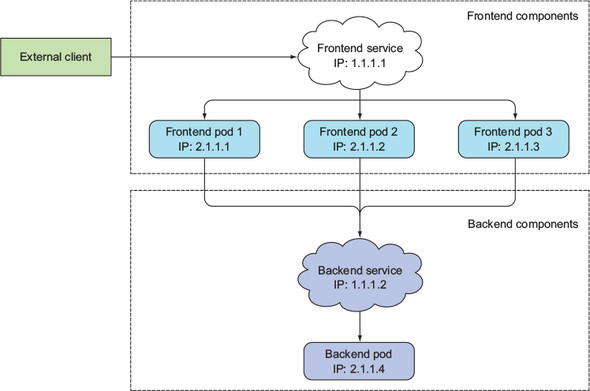
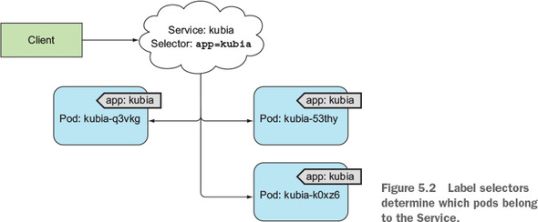
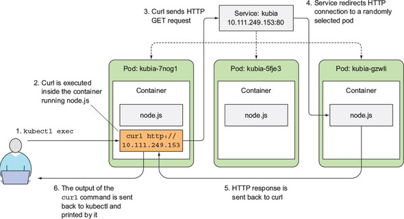
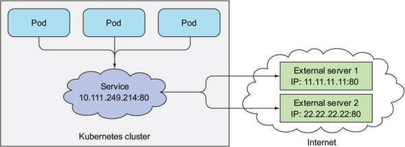
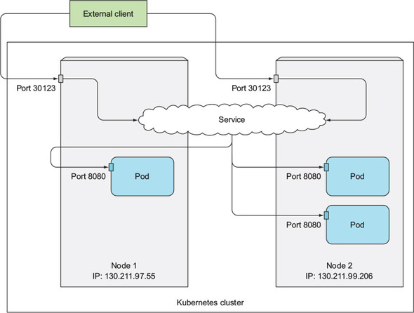

# 5장 서비스: 클라이언트가 파드를 검색하고 통신을 가능하게 함

## 5.1 서비스 소개

- 쿠버네티스에서 클라이언트 구성 파일에 서비스를 제공하는 서버의 IP 주소나 호스트 이름을 지정해 클라이언트 애플리케이션을 구성할 수 없는 이유
  - 파드가 다른 파드를 위한 공간을 확보하려고 제거되거나, 파드 수를 줄이거나, 클러스터 노드의 장애로 다른 노드로 이동할 수 있음
  - 노드에 파드를 스케줄링한 후 파드기 시작되기 바로 전에 파드의 IP 주소를 할당하므로 미리 알 수 없음
  - 수평 스케일링 시 각 파드는 고유한 IP 주소가 있으며, 모든 파드는 단일 IP 주소로 액세스할 수 있어야 함
- 서비스: 동일한 서비스를 제공하는 파드 그룹에 지속적인 단일 접점을 만들기 위한 리소스

#### 예제를 통한 서비스 설명

- 여러 개의 프론트엔드 파드와 단일 백엔드 데이터베이스 파드로 구성된 시스템
  - 웹 서버의 수와 상관없이 외부에서 프론트엔드 파드에 연결할 수 있어야 함
  - 백엔드 데이터베이스가 클러스터 주위를 이동해 IP 주소가 변경되더라도 프론트엔드 파드를 재설정하지 않아야 함
- 프론트엔드 파드 및 백엔드 파드에 대한 서비스를 만들어 하나의 고정 IP 주소로 노출



### 5.1.1 서비스 생성

- 레이블 셀렉터를 사용해 동일한 세트에 속하는 파드를 지정



#### kubectl expose로 서비스 생성

- expose 명령어는 파드 셀렉터를 사용해 서비스 리소스를 생성하고 모든 파드를 단일 IP 주소와 포트로 노출

#### YAML 디스크립터를 통한 서비스 생성

```yaml
apiVersion: v1
kind: Service
metadata:
	name: kubia
spec:
	ports:
	- port: 80
		targetPort: 8080
	selector:
		app: kubia
```

- 포트 80의 연결을 허용하고 각 연결을 app=kubia 레이블 셀렉터와 일치하는 파드의 포트 8080으로 라우팅
- kubectl create를 사용해 yaml 파일을 게시해 서비스 생성

#### 새 서비스 검사하기

- kubectl get 명령을 사용해 네임스페이스의 모든 서비스 리소스 조회 및 내부 클러스터 IP 할당 여부 확인

```shell
$ kubectl get svc
```

- 서비스를 외부로 노출하기를 원할 경우 추가 설정 필요

#### 클러스터 내에서 서비스 테스트

- 클러스터 내 서비스 요청 방법
  - 서비스의 클러스터 IP로 요청을 보내고 응답을 로그로 남기는 파드를 통해 확인
  - 쿠버네티스 노드로 ssh 접속 후 curl 명령 실행
  - kubectl exec 명령어로 기존 파드에서 curl 명령 실행

#### 실행 중인 컨테이너에 원격으로 명령어 실행

- kubectl exec 명령어를 사용해 기존 파드의 컨테이너 내에서 원격으로 임의의 명령어 실행 가능
  - 컨테이너의 내용, 상태, 환경을 검사할 때 사용
- kubectl get pods 명령어로 파드를 조회하고 exec 명령어의 대상 선택
- kubectl get svc 명령어로 클러스터 IP 확인

```shell
$ kubectl exec kubia-7nog1 -- curl -s http://10.111.249.153
```

<aside>
ℹ️ 명령어의 더블 대시(—)는 kubectl 명령줄 옵션의 끝을 의미하며, 더블 대시 뒤의 모든 명령어는 파드 내에서 실행될 명령
</aside>

- curl은 HTTP 요청을 서비스 IP로 보내고, 서비스 프록시가 서비스와 연결된 세 개의 파드 중 임의의 파드로 요청 전달



#### 서비스의 세션 어피니티 구성

- 동일한 클라이언트 요청에 대해 서비스 프록시가 임의의 파드가 아닌 지정된 파드로 리디렉션 하도록 설정하려면 서비스의 세션 어피니티 속성을 ClientIP로 설정

```yaml
apiVersion: v1
kind: Service
spec:
	sessionAffinity: ClientIP
...
```

<aside>
⚠️ 쿠버네티스 서비스는 HTTP 수준에서 작동하지 않으므로, 세션 어피니티를 쿠키 기반으로 할 수 없음
</aside>

#### 동일한 서비스에서 여러 개의 포트 노출

- 멀티 포트 서비스를 사용해 단일 클러스터 IP로 모든 서비스 포트 노출 가능

<aside>
ℹ️ 멀티 포트 서비스 생성 시 각 포트의 이름 지정 필요
</aside>

```yaml
apiVersion: v1
kind: Service
metadata:
	name: kubia
spec:
	ports:
	- name: http
		port: 80
		targetPort: 8080
	- name: https
		port: 443
		targetPort: 8443
	selector:
		app: kubia
```

#### 이름이 지정된 포트 사용

- 파드의 포트에 이름을 지정하고 서비스 스펙에서 이름으로 참조 가능

```yaml
kind: Pod
spec:
	containers:
	- name: kubia
		ports:
		- name: http
			containerPort: 8080
		- name: https
			containerPort: 8443
```

```yaml
apiVersion: v1
kind: Service
spec:
	ports:
	- name: http
		port: 80
		targetPort: http
	- name: https
		port: 443
		targetPort: https
```

- 이름이 지정된 포트를 사용할 경우 서비스 스펙 변경 없이 포트 번호 변경 가능

### 5.1.2 서비스 검색

- 클라이언트 파드가 서비스의 IP와 포트를 검색할 수 있는 방법 제공

#### 환경변수를 통한 서비스 검색

- 클라이언트 파드 생성 전 서비스를 생성하면 환경변수를 통해 서비스 IP 주소 및 포트 확인 가능
- 서비스 생성 이전 생성된 모든 파드 삭제 후 새로운 파드 생성

```shell
$ kubectl delete po -all
```

- kubectl exec 명령을 사용해 컨테이너 내부에서 env 명령어를 실행해 환경변수 조회

```shell
$ kubectl exec kubia-3inly env
```

- KUBIA_SERVICE_HOST, KUBIA_SERVICE_PORT 환경변수로 서비스의 클러스터 IP와 서비스가 제공되는 포트 확인 가능

<aside>
ℹ️ 서비스 이름의 대시(-)는 밑줄(_)로 변환되고 서비스 이름이 환경변수 이름의 접두어로 쓰이면서 대문자로 표시됨
</aside>

#### DNS를 통한 서비스 검색

- kube-system 네임스페이스의 kube-dns 서비스를 통해 DNS 서버를 실행하여 클러스터에서 실행 중인 다른 모든 파드가 자동으로 이를 사용하도록 구성(쿠버네티스는 각 컨테이너의 /etc/resolv.conf 파일을 수정해 이를 수행)

<aside>
ℹ️ 파드 스펙의 dnsPolicy 속성을 통해 내부 DNS 서버 사용 여부 설정
</aside>

#### FQDN을 통한 서비스 연결

- 프론트엔드-백엔드 예제에서 프론트엔드 파드는 다음 FQDN으로 백엔드 데이터베이스 서비스에 연결

```
backend-database.default.svc.cluster.local
```

- backend-database: 서비스 이름
- default: 서비스가 정의된 네임스페이스
- svc.cluster.local: 모든 클러스터의 로컬 서비스 이름에 사용되는 클러스터 도메인 접미사

<aside>
⚠️ 서비스가 표준 포트를 사용하지 않는 경우 클라이언트는 서비스 포트 번호를 알아야 함
</aside>

- 서비스 연결 시 프론트엔드 파드가 데이터베이스 파드와 동일한 네임스페이스에 있는 경우 클러스터 도메인 접미사와 네임스페이스는 생략 가능

#### 파드의 컨테이너 내에서 셸 실행

- kubectl exec 명령어를 사용해 파드의 컨테이너 내에서 bash 실행

```shell
$ kubectl exec -it kubia-3inly bash
```

- curl 명령어를 사용해 kubia 서비스 액세스

```shell
$ curl http://kubia.default.svc.cluster.local
$ curl http://kubia.default
$ curl http://kubia
```

#### 서비스 IP에 핑을 할 수 없는 이유

- 서비스 클러스터 IP는 가상 IP이므로 서비스 포트와 결합된 경우에만 의미가 있기 때문에 핑은 응답이 없음

## 5.2 클러스터 외부에 있는 서비스 연결

- 서비스 로드밸런싱과 서비스 검색을 활용하여 클러스터 내 파드가 아닌 외부 IP와 포트로 연결 전달

### 5.2.1 서비스 엔드포인트 소개

- 서비스는 서비스와 파드 사이의 엔드포인트 리소스를 통해 파드에 연결
- kubectl describe 명령을 사용해 엔드포인트 확인 가능

```shell
$ kubectl describe svc kubia
```

- 서비스로 노출되는 파드의 IP 주소와 포트 목록
- kubectl get 명령을 사용해 엔드포인트 기본 정보 확인

```shell
$ kubectl get endpoints kubia
```

- 파드 셀렉터는 IP와 포트 목록을 작성하는 데 사용돠며 엔드포인트 리소스에 저장됨
- 클라이언트가 서비스에 연결하면 서비스 프록시는 이들 중 하나의 IP와 포트 쌍을 선택하고, 들어온 연결을 대상 파드의 수신 대기 서버로 전달함

### 5.2.2 서비스 엔드포인트 수동 구성

- 서비스의 엔드포인트를 서비스와 분리하면 수동 구성 및 업데이트 가능
- 파드 셀렉터 없이 서비스 생성 시 엔드포인트 리소스 생성 불가(파드 셀렉터가 없어, 서비스에 포함된 파드가 무엇인지 알 수 없음)
- 수동으로 관리되는 엔드포인트를 사용해 서비스를 만들기 위해 서비스와 엔드포인트 리소스 모두 생성 필요

#### 셀럭터 없이 서비스 생성

```yaml
apiVersion: v1
kind: Service
metadata:
	name: external-service
spec:
	ports:
	- port: 80
```

#### 셀렉터가 없는 서비스에 관한 엔드포인트 리소스 생성

```yaml
apiVersion: v1
kind: Endpoints
metadata:
	name: external-service
subjects:
	- addresses:
		- ip: 11.11.11.11
		- ip: 22.22.22.22
		ports:
		- port: 80
```

- 엔드포인트 오브젝트의 이름은 서비스 이름과 일치해야 함




### 5.2.3 외부 서비스를 위한 별칭 설정

- FQDN으로 외부 서비스 참조 가능

#### ExternalName 서비스 생성

- 외부 서비스의 별칭으로 사용되는 서비스를 만들기 위해 유형 필드를 ExternalName으로 설정

```yaml
apiVersion: v1
kind: Service
metadata:
	name: external-service
spec:
	type: ExternalName
	externalName: someapi.somecompany.com
	ports:
	- port: 80
```

- 파드는 FQDN 대신 external-service.default.svc.cluster.local 도메인 이름(또는 external-service)으로 외부 서비스에 연결 가능
- externalName 속성을 변경하거나 유형을 다시 ClusterIP로 변경하고 서비스 스펙을 만들어 다른 서비스를 가리킬 수 있음
- ExternalName 서비스는 DNS 레벨에서만 구현되며, CNAME DNS 레코드가 생성됨
- 클라이언트에서 서비스 연결 시 서비스 프록시를 무시하고 직접 연결
- ExternalName 유형의 서비스는 ClusterIP를 얻을 수 없음

<aside>
ℹ️ CNAME 레코드는 IP 주소 대신 FQDN을 가리킴
</aside>

## 5.3 외부 클라이언트에 서비스 노출

- 외부에서 서비스를 액세스할 수 있는 방법
  - 노드포트로 서비스 유형 설정
    - 각 클러스터 노드는 노드 자체에서 포트를 열고 해당 포트로 수신된 트래픽을 서비스로 전달
  - 서비스 유형을 노드포트 유형의 확장인 로드밸런서로 설정
    - 실행 중인 클라우드 인프라에서 프로비저닝된 전용 로드밸런서로 서비스에 액세스
    - 로드밸런서는 트래픽을 모든 노드의 노드포트로 전달하고, 클라이언트는 노드밸런서의 IP로 서비스에 액세스
  - 단일 IP 주소로 여러 서비스를 노출하는 인그레스 리소스 만들기
    - HTTP 레벨에서 작동하여 4계층 서비스(전송 레이어)보다 더 많은 기능 제공(5.4절 참고)

### 5.3.1 노드포트 서비스 사용

- 서비스를 생성하고 유형을 노드포트로 설정
- 모든 노드에 특정 포트를 할당하고(모든 노드에서 동일한 포트 번호 사용) 서비스를 구성하는 파드로 연결 전달
- 서비스 내부 클러스터IP 뿐만 아니라 모든 노드의 IP와 할당된 노드포트로 서비스 액세스 가능

#### 노드포트 서비스 생성

```yaml
apiVersion: v1
kind: Service
metadata:
	name: kubia-nodeport
spec:
	type: NodePort
	ports:
	- port: 80
		targetPort: 8080
		nodePort: 30123
	selector:
		app: kubia
```

- 노드포트 생략 시 임의의 포트가 지정됨

#### 노드포트 서비스 확인

```shell
$ kubectl get svc kubia-nodeport
NAME             CLUSTER-IP       EXTERNAL-IP   PORT(S)        AGE
kubia-nodeport   10.111.254.223   <nodes>       80:30123/TCP   2m
```

- 액세스 가능한 주소
  - 10.111.254.223:80
  - <첫 번째 노드의 IP>:30123
  - <두 번째 노드의 IP>:30123 등



#### 외부 클라이언트가 노드포트 서비스에 액세스할 수 있도록 방화벽 규칙 변경

- 노드포트에 대한 외부 연결을 허용하도록 구글 클라우드 플랫폼(GCP) 방화벽 구성 필요

```shell
$ gcloud compute firewall-rules create kubia-svc-rule --allow=tcp:30123
```