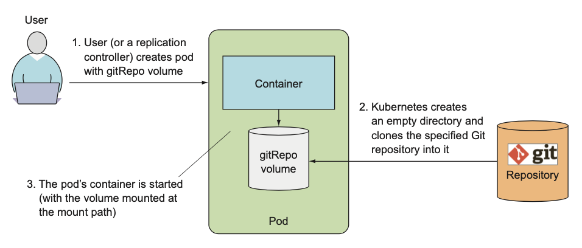

# 6장 볼륨: 컨테이너에 디스크 스토리지 연결

## 6.1 볼륨 소개

- 새로 시작한 컨테이너는 이전에 실행했던 컨테이너에 쓰여진 파일시스템의 어떤 것도 볼 수 없음
- 스토리지 볼륨을 통해 실제 데이터를 가진 디렉터리를 보존 가능
  - 파드의 구성 요소로 컨테이너와 동일하게 파드 스펙에 정의됨
  - 독립적인 쿠버네티스 오브젝트가 아니므로 자체적으로 생성, 삭제될 수 없음
  - 파드의 모든 컨테이너에서 사용 가능하며, 접근하려는 컨테이너에서 각각 마운트 필요

### 6.1.1 예제의 볼륨 설명

- 아래와 같은 컨테이너 세 개가 있는 파드가 있다고 가정
  - /var/htdocs 디렉터리에서 HTML 페이지를 서비스하고 /var/logs에 액세스 로그를 저장하는 웹 서버
  - /var/html에 HTML 파일을 생성하는 에이전트
  - /var/logs 디렉터리의 로그 처리
- 각 컨테이너가 파일을 자체 컨테이너 내에서 처리한다면 아무런 의미가 없음
- 두 볼륨(/var/htdocs, /var/html)을 파드에 추가하고 세 개의 컨테이너 내부의 적절한 경로에 마운트하여 공유 가능
- 볼륨을 초기화하며 외부 소스의 내용을 채우거나, 볼륨 내부에 기존에 존재하는 디렉터리를 마운트하는 것과 같은 볼륨 지원하며, 파드의 컨테이너가 시작되기 전에 수행됨


### 6.1.2 사용 가능한 볼륨 유형 소개

- 사용 가능한 볼륨 유형
  - emptyDir: 일시적인 데이터를 저장하는 빈 디렉터리
  - hostPath: 워커 노드의 파일시스템을 파드의 디렉터리로 마운트
  - gitRepo: 깃 리포지터리의 콘텐츠를 체크아웃해 초기화한 볼륨
  - nfs: NFS 공유를 파드에 마운트
  - gcePersistentDisk, awsElasticBlockStore, azureDisk: 클라우드 제공자의 전용 스토리지 마운트
  - cinder, cephfs, iscsi, flocker, glusterfs, quobyte, rbd, flexVolume, vsphereVolume, photonPersistentDisk, scaleIO: 다른 유형의 네트워크 스토리지 마운트
  - configMap, secret, downwardAPI: 쿠버네티스 리소스나 클러스터 정보를 파드에 노출하는 데 사용되는 볼륨
  - persistentVolumeClaim: 사전에 혹은 동적으로 프로비저닝된 퍼시스턴트 스토리지

## 6.2 볼륨을 사용한 컨테이너 간 데이터 공유

### 6.2.1 emptyDir 볼륨 사용

- 빈 디렉터리로 시작되는 볼륨
- 파드에 실행 중인 애플리케이션은 어떤 파일이든 볼륨에 쓰기 가능
- 파드가 삭제되면 볼륨의 콘텐츠는 사라짐
- 동일 파드에서 실행 중인 컨테이너 간 파일 공유, 임시 데이터를 디스크에 쓰는 목적으로 사용

#### 파드에 emptyDir 볼륨 사용

- Nginx를 웹 서버로 사용하고 fortune 명령으로 HTML 콘텐츠를 생성하는 컨테이너 사용
- Fortune 컨테이너 이미지 빌드하기

    ```shell
    #!/bin/bash
    trap "exit" SIGINT
    while :
    do
    	echo $(date) Writing fortune to /var/htdocs/index.html
    	/usr/games/fortune > /var/htdocs/index.html
    	sleep 10
    done
    ```

    ```dockerfile
    FROM ubuntu:latest
    RUN apt-get update ; apt-get -y install fortune
    ADD fortuneloop.sh /bin/fortuneloop.sh
    ENTRYPOINT /bin/fortuneloop.sh
    ```

    ```shell
    $ docker build -t luksa/fortune .
    $ docker push luksa/fortune
    ```

#### 파드 생성하기

```yaml
apiVersion: 1
kind: Pod
metadata:
	name: fortune
spec:
	containers:
	- image: luksa/fortune
		name: html-generator
		volumeMounts:
		- name: html
			mountPath: /var/htdocs
	- image: nginx:alpine
		name: web-server
		volumeMounts:
		- name: html
			mountPath: /usr/share/nginx/html
			readOnly: true
		ports:
		- containerPort: 80
			protocol: TCP
	volumes:
	- name: html
		emptyDir: {}
```

- 컨테이너 두 개와 각 컨테이너에 각기 다른 경로로 마운트된 단일 볼륨을 가짐
- html-generator 컨테이너는 매 10초마다 fortune 명령의 결과를 /var/htdocs/index.html에 씀
- 볼륨이 /var/htdocs에 마운트되어 index.html 파일은 볼륨에 쓰여짐
- web-server 컨테이너는 /usr/share/nginx/html 디렉터리의 HTML 파일 서비스
- 볼륨이 /usr/share/nginx/html에 마운트되어 html-generator 컨테이너가 작성한 index.html 파일 서비스

#### 실행 중인 파드 보기

```shell
$ kubectl port-forward fortune 8080:80
```

```shell
$ curl http://localhost:8080
```

#### emptyDir을 사용하기 위한 매체 지정하기

- emptyDir을 디스크 파일시스템으로 생성 시 파드를 호스팅하는 워커 노드의 디스크 유형에 따라 성능 결정
- emptyDir을 디스크가 아닌 메모리를 사용하는 tmpfs 파일시스템으로 생성하도록 요청 가능

```yaml
volumes:
  - name: html
    emptyDir:
      medium: Memory
```

### 6.2.2 깃 리포지터리를 볼륨으로 사용하기

- gitRepo 볼륨은 기본적으로 emptyDir 볼륨
- 파드가 시작되면 컨테이너가 생성되기 전 깃 리포지터리를 복제하고 특정 리비전을 체크아웃해 데이터를 채움



- gitRepo 볼륨이 생성된 후에는 참조하는 리포지터리와 동기화하지 않음
  - 단, 레플리케이션컨트롤러가 삭제된 파드를 대체하기 위해 생성한 새 파드의 볼륨은 최신 커밋을 포함함

#### 복제된 깃 리포지터리 파일을 서비스하는 웹 서버 실행하기

- gitRepo 볼륨을 가진 파드를 생성하기 위해 깃 리포지터리 준비
  - https://github.com/luksa/kubia-website-example.git 참고

```yaml
apiVersion: v1
kind: Pod
metadata:
	name: gitrepo-volume-pod
spec:
	containers:
	- image: nginx:alpine
		name: web-server
		volumeMounts:
		- name: html
			mountPath: /usr/share/nginx/html
			readOnly: true
		ports:
		- containerPort: 80
			protocol: TCP
	volumes:
	- name: html
		gitRepo:
			repository: https://github.com/luksa/kubia-website-example.git
			revision: master
			directory: .
```

- 파드를 생성하면 볼륨은 먼저 빈 디렉터리를 초기화한 다음 특정 깃 리포지터리 복제
- .으로 지정된 directory 값에 의해 볼륨의 루트 디렉터리에 복제

<aside>
⚠️ directory를 .으로 지정하지 않을 경우 kubia-website-example 하위 디렉토리로 복제
</aside>

- master 브랜치가 가리키는 버전 체크아웃

#### 깃 리포지터리와 파일 동기화 여부 확인하기

- 깃 리포지터리의 master 브랜치에서 index.html 파일을 변경하더라도 Nginx 웹 서버에 반영되지 않음
- 웹 서버에 변경 사항을 반영하기 위해서는 파드 삭제 후 재생성 필요

<aside>
ℹ️ 파드를 삭제하는 대신에 볼륨이 항상 깃 리포지터리와 동기화하도록 추가 프로세스 실행 가능
</aside>

#### 사이드카 컨테이너 소개

- 깃 리포지터리 동기화 프로세스는 Nginx 웹 서버와 동일 컨테이너에가 아닌 사이드카 컨테이너에서 실행
- 파드의 주 컨테이너 동작 보완 역할
- 새로운 로직이 애플리케이션 코드에 추가되는 경우 복잡성 증가, 재사용성 감소
- 도커 허브에서 "git sync"를 검색하여 로컬 디렉터리를 깃 리포지터리와 동기화도되록 유지하는 컨테이너 사용 가능
- 예제의 파드에서 새 컨테이너에 위 이미지를 사용하고 기존 gitRepo 볼륨을 새 컨테이너에 마운트하여 파일 동기화 유지 설정 가능 (18장에서 동기화 컨테이너 사용 포함)

#### 프라이빗 깃 리포지터리로 gitRepo 볼륨 사용하기

- 프라이빗 리포지터리를 SSH 프로토콜을 통해 복제하는 방식 지원 안 함
- 깃 동기화 사이드카 또는 gitRepo 볼륨을 대신하는 다른 방법을 사용해야 함

#### gitRepo 볼륨에 대한 정리

- emptyDir 볼륨과 유사하게 기본적으로 볼륨을 포함하는 파드를 위해 특별히 생성되고 독점적으로 사용되는 전용 디렉터리
- 파드가 삭제되면 볼륨과 콘텐츠는 삭제됨
- gitRepo 볼륨은 minikube v1.11부터 deprecated되어 initContainer 방식으로 전환 필요
  - [https://gist.github.com/tallclair/849601a16cebeee581ef2be50c351841](https://gist.github.com/tallclair/849601a16cebeee581ef2be50c351841)

## 6.3 워커 노드 파일시스템의 파일 접근

- hostPath 볼륨을 통해 노드의 파일을 읽거나 파일시스템을 통해 노드 디바이스를 접근하기 위해 노드의 파일시스템 사용 가능

### 6.3.1 hostPath 볼륨 소개

- 노드 파일시스템의 특정 파일이나 디렉터리를 가리킴
- 동일 노드에 실행 중인 파드가 hostPath 볼륨의 동일 경로를 사용 중일 경우 동일한 파일이 표시됨


- 파드가 종료되더라도 볼륨의 콘텐츠가 삭제되지 않음
- 파드가 삭제되면 다음 파드가 호스트의 동일 경로를 가리키는 hostPath 볼륨을 사용하고, 이전 파드와 동일한 노드에 스케줄링된다는 조건에서 새로운 파드는 이전 파드가 남긴 모든 항목을 볼 수 있음
- 특정 노드의 파일시스템에 저장되므로 파드가 다른 노드로 다시 스케줄링되면 데이터를 볼 수 없음
- 파드가 어떤 노드에 스케줄링되느냐에 따라 민감

### 6.3.2 hostPath 볼륨을 사용하는 시스템 파드 검사하기

```shell
$ kubectl get pods --namespace kube-system
```

```shell
$ kubectl describe po fluentd-kubia-4ebc2f1e-9a3e --namespace kube-system
```

- 대부분의 파드는 노드의 로그파일이나 kubeconfig, CA 인증서를 접근하기 위해 hostPath 볼륨 사용
- 노드의 시스템 파일에 읽기/쓰기를 하는 경우에만 hostPath 볼륨 사용
  - 여러 파드에 걸쳐 데이터를 유지하기 위해서 사용하는 것은 권장하지 않음

## 6.4 퍼시스턴트 스토리지 사용

- 파드에서 실행 중인 애플리케이션이 디스크에 데이터를 유지해야 하고 파드가 다른 노드로 재스케줄링된 경우에도 동일한 데이터를 사용해야 할 경우 사용하는 볼륨 유형

<aside>
ℹ️ 퍼시스턴트 스토리지를 사용하기 위해서는 사용할 스토리지가 사전에 프로비저닝 되어 있어야 함
</aside>

### 6.4.1 GCE 퍼시스턴트 디스크를 파드 볼륨으로 사용하기

#### GCE 퍼시스턴트 디스크 생성하기

- 쿠버네티스 클러스터가 있는 동일한 영역에 생성하기 위해 gcloud 명령으로 쿠버네티스 클러스터 조회

```shell
$ gcloud container clusters list
```

- GCE 퍼시스턴트 디스크 생성

```shell
$ gcloud compute disks create --size=1GiB --zone=europe-west1-b mongodb
```

#### GCE 퍼시스턴트 디스크 볼륨을 사용하는 파드 생성하기

```yaml
apiVersion: v1
kind: Pod
metadata:
	name: mongodb
spec:
	volumes:
	- name: mongodb-data
		gcePersistentDisk:
			pdName: mongodb
			fsType: ext4
	containers:
	- image: mongo
		name: mongodb
		volumeMounts: 
		- name: mongodb-data
			mountPath: /data/db
		ports:
		- containerPort: 27017
			protocol: TCP
```

- 퍼시스턴트 디스크의 이름은 반드시 이전에 생성한 실제 PD와 일치해야 함
- 볼륨을 컨테이너 내부의 MongoDB가 데이터를 저장하는 /data/db에 마운트

#### MongoDB 데이터베이스에 도큐먼트를 추가해 퍼시스턴트 스토리지에 데이터 쓰기

```shell
$ kubectl exec -it mongodb mongo
```

```shell
> use mystore
> db.foo.insert({name:'foo'})
```

#### 파드를 다시 생성하고 이전 파드가 저장한 데이터를 읽을 수 있는지 확인하기

```shell
$ kubectl delete pod mongodb
$ kubectl create -f mongodb-pod-gcepd.yaml
```

- 새로운 파드가 이전 파드와 다른 노드에 스케줄링되더라도 데이터 확인 가능

<aside>
ℹ️ kubectl get po -o wide 명령으로 어떤 노드에 파드가 스케줄링됐는지 확인
</aside>

```shell
$ kubectl exec -it mongodb mongo
> use mystore
> db.foo.find()
```

### 6.4.2 기반 퍼시스턴트 스토리지로 다른 유형의 볼륨 사용하기