# 7장 컨피그맵과 시크릿: 애플리케이션 설정

## 7.1 컨테이너화된 애플리케이션 설정

- 애플리케이션 구성 방법
  - 컨테이너에 명령줄 인수 전달
  - 각 컨테이너를 위한 사용자 정의 환경변수 지정
  - 특수한 유형의 볼륨을 통해 설정 파일을 컨테이너에 마운트
- 설정 파일 사용 시, 설정 파일을 컨테이너 이미지 안에 포함하거나 파일이 포함돼 있는 볼륨을 컨테이너에 마운트 필요
  - 민감 정보를 포함된 파일을 이미지에 넣고 빌드해야 하기 때문에 보안적으로 취약할 수 있어 환경변수가 널리 사용됨
- 컨피그맵(ConfigMap)
  - 설정 데이터를 저장하는 쿠버네티스 리소스

## 7.2 컨테이너에 명령줄 인자 전달

- 파드 컨테이너 정의에 지정된 실행 명령 대신 다른 실행 파일을 실행하거나 다른 명령줄 인자를 사용해 실행 가능

### 7.2.1 도커에서 명령어와 인자

#### ENTRYPOINT와 CMD 이해

- Dockerfile 정의
  - ENTRYPOINT: 컨테이너가 시작될 때 호출어 명령어 정의
  - CMD: ENTRYPOINT에 전달되는 인자 정의
- 아무런 인자도 지정하지 않고 이미지 실행

```shell
$ docker run <image>
```

- 추가 인자를 지정해 Dockerfile 안의 CMD에 정의된 값 재정의

```shell
$ docker run <image> <arguments>
```

#### shell과 exec 형식 간의 차이점

- 내부에서 정의된 명령을 셸로 호출하는지 여부에 따라 다름
- shell 형식
  - ENTRYPOINT node app.js (예시)
  - 메인 프로세스는 shell 프로세스가 됨
- exec 형식
  - ENTRYPOINT ["node", "app.js"] (예시)
  - 프로세스가 직접 실행됨

#### fortune 이미지에서 간격을 설정할 수 있도록 만들기

- fotune 이미지에 INTERVAL 변수 추가

```shell
#!/bin/bash
trap "exit" SIGINT
INTERVAL=$1
echo Configured to generate new fortune every $INTERVAL seconds
mkdir -p /var/htdocs
while :
do
	echo $(date) Writing fortune to /var/htdocs/index.html
	/usr/games/fortune > /var/htdocs/index.html
	sleep $INTERVAL
done
```

- exec 버전 ENTRYPOINT 명령을 사용하도록 Dockerfile 수정

```dockerfile
FROM ubuntu:latest
RUN apt-get update ; apt-get -y install fortune
ADD fortuneloop.sh /bin/fortuneloop.sh
ENTRYPOINT ["/bin/fortuneloop.sh"]
CMD ["10"]
```

- exec 형태의 ENTRYPOINT 추가
- 실행할 때 사용할 기본 인자 추가

```shell
$ docker build -t docker.io/luksa/fortune:args .
$ docker push docker.io/luksa/fortune:args
```

```shell
$ docker run -it docker.io/luksa/fortune:args
```

```shell
$ docker run -it docker.io/luksa/fortune:args 15
```

### 7.2.2 쿠버네티스에서 명령과 인자 재정의

- 컨테이너 정의 안에 command와 args 속성을 지정하여 ENTRYPOINT 및 CMD 재정의 가능

```yaml
kind: Pod
spec:
	containers:
	- image: some/image
		command: ["/bin/command"]
		args: ["arg1", "arg2", "arg3"]
```

<aside>
⚠️ command와 args 필드는 파드 생성 이후에 업데이트 할 수 없음
</aside>

- [도커와 쿠버네티스의 실행파일과 인자를 지정하는 방법 비교](https://www.notion.so/5f0d0e65a9994474811fc4cdedad8310)
- 인자를 재정의하는 경우가 있으나 명령어를 재정의하는 경우는 거의 없음

#### 사용자 정의 주기로 fortune 파드 실행

```yaml
apiVersion: v1
kind: Pod
metadata:
	name: fortune2s
spec:
	containers:
	- image: luksa/fortune:args
		args: ["2"]
		name: html-generator
		volumeMounts:
		- name: html
			mountPath: /var/htdocs
...
```

- fortune:args 이미지를 사용하고 스크립트가 2초마다 새로운 fortune 메시지를 생성하도록 인자 지정

```yaml
args:
- foo
- bar
- "15"
```

<aside>
ℹ️ 문자열 값을 따옴표로 묶을 필요는 없으며 숫자는 묶어야 함
</aside>

# 7.3 컨테이너의 환경변수 설정

- 파드의 각 컨테이너를 위한 환경변수 리스트 지정 가능

<aside>
⚠️ 환경변수 목록은 파드 생성 후에는 업데이트할 수 없음
</aside>

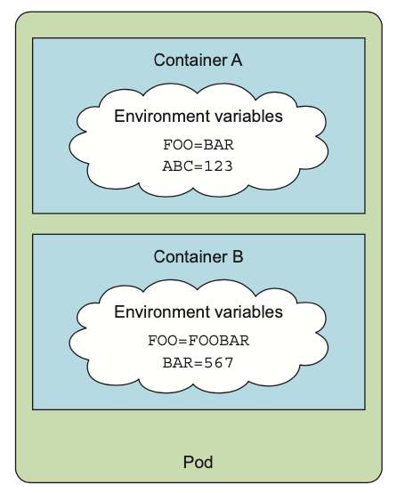

#### 환경변수로 fortune 이미지 안에서 간격을 설정할 수 있도록 만들기

```shell
#!/bin/bash
trap "exit" SIGINT

~~INTERVAL=$1~~
echo Configured to generate new fortune every $INTERVAL seconds
mkdir -p /var/htdocs
while :
do
	echo $(date) Writing fortune to /var/htdocs/index.html
	/usr/games/fortune > /var/htdocs/index.html
	sleep $INTERVAL
done
```

- 애플리케이션 언어 별 환경변수 참조 예시
  - Java

    ```java
    System.getenv("INTERVAL")
    ```

  - Node.JS

    ```jsx
    process.env.INTERVAL
    ```

  - Python

    ```python
    os.environ['INTERVAL']
    ```


### 7.3.1 컨테이너 정의에 환경변수 지정

```yaml
kind: Pod
spec:
	containers:
	- image: luksa/fortune:env
		env:
		- name: INTERVAL
			value: "30"
		name: html-generator
...
```

- 환경 변수는 파드 레벨이 아닌 컨테이너 정의 안에 설정
- 쿠버네티스는 각 컨테이너를 설정할 때 자동으로 동일한 네임스페이스 안에 있는 각 서비스(쿠버네티스에서 정의하는 서비스, 5장 참고)에 환경변수를 노출함
  - 컨테이너 → 서비스 인지 서비스 → 컨테이너 인지 판단이 어려움

### 7.3.2 변숫값에서 다른 환경변수 참조

```yaml
env:
- name: FIRST_VAR
	value: "foo"
- name: SECOND_VAR
	value: "$(FIRST_VAR)bar"
```

- command와 args 속성 모두 위와 같이 환경변수 참조 가능

### 7.3.3 하드코딩된 환경변수의 단점

- 프로덕션과 개발을 위해 서로 분리된 파드 정의가 필요
- 여러 환경에서 동일한 파드 정의를 재사용하기 위해 설정을 분리하는 것이 좋음
- value 필드 대신 valueFrom을 사용하여 환경변숫값의 원본 소스로 사용 가능

## 7.4 컨피그맵으로 설정 분리

- 환경에 따라 다르거나 자주 변경되는 설정 옵션을 애플리케이션 소스 코드와 별도로 유지

### 7.4.1 컨피그맵 소개

- 설정 옵션을 별도로 분리하기 위한 오브젝트
- 짧은 문자열에서 전체 설정 파일에 이르는 값을 가지는 키/값 쌍으로 구성된 맵
- 맵의 내용은 컨테이너의 환경변수 또는 볼륨 파일로 전달
- 환경변수는 $(ENV_VAR) 구문을 사용해 명령줄 인수에서 참조 가능

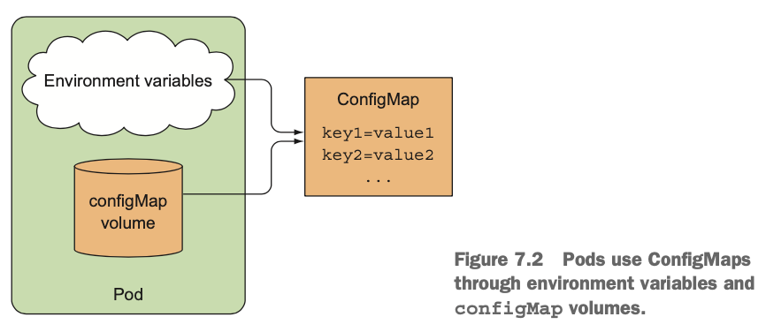

- 애플리케이션에서 필요한 경우 쿠버네티스 REST API 엔드포인트를 통해 컨피그맵 읽기 가능
  - 반드시 필요한 경우가 아니라면 애플리케이션은 쿠버네티스와는 무관하도록 유지해야 함
- 별도의 독립적인 오브젝트에 설정을 포함하여 각각 다른 환경(개발, 테스트, QA, 프로덕션 등)에 대해 동일한 이름으로 컨피그맵에 관한 여러 매니페스트 유지 가능

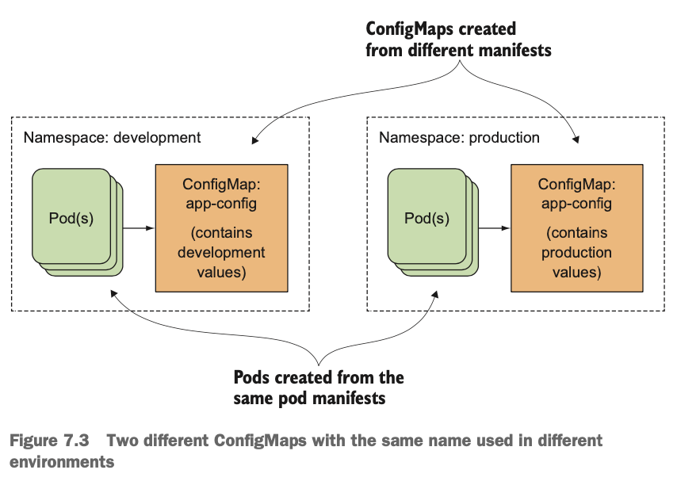

### 7.4.2 컨피그맵 생성

- kubectl create -f 명령어로 YAML 파일 게시 또는 kubectl create configmap 명령어로 생성

#### kubectl create configmap 명령 사용

```shell
$ kubectl create configmap fortune-config --from-literal=sleep-interval=25
```

<aside>
ℹ️ 컨피그맵 키는 유효한 DNS 서브도메인(subdomain)이어야 함(영숫자, 대시, 밑줄, 점 포함 가능)
</aside>

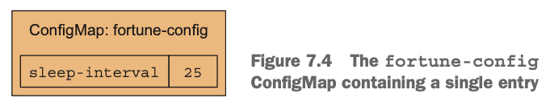

```shell
$ kubectl create configmap myconfigmap\
	--from-literal=foo=bar --from-literal=bar=baz --from-literal=one=two
```

- kubectl get 명령으로 컨피그맵 YAML 정의 출력

```yaml
apiVersion: v1
data:
	sleep-interval: "25"
kind: ConfigMap
metadata:
	creationTimestamp: 2016-08-11T20:31:08Z
	name: fortune-config
	namespace: default
	resourceVersion: "910025"
	selfLink: /api/v1/namespace/default/configmaps/fortune-config
	uid: 88c4167e-6002-11e6-a50d-42010af00237
```

- metadata 섹션에 name을 뺀 나머지를 지정하지 않고 kubectl create -f 명령으로 쿠버네티스 API 게시 가능

```shell
$ kubectl create -f fortune-config.yaml
```

#### 파일 내용으로 컨피그맵 생성

- kubectl create configmap 명령을 이용해 파일 내용을 개별 항목으로 저장 가능

```shell
$ kubectl create configmap my-config --from-file=config-file.conf
```

```shell
$ kubectl create configmap my-config --from-file=customkey=config-file.conf
```

- —from-file 인수를 여러 번 사용해 여러 파일 추가 가능

#### 디렉터리에 있는 파일로 컨피그맵 생성

```shell
$ kubectl create configmap my-config --from-file=/path/to/dir
```

- 파일 이름이 컨피그맵 키로 사용하기에 유효한 파일만 추가됨

#### 다양한 옵션 결합

- 컨피그맵 생성 시 모든 옵션 조합 가능

```shell
$ kubectl create configmap my-config\
	--from-file=foo.json\
	--from-file=bar=foobar.conf\
	--from-file=config-opts/\
	--from-literal=some=thing
```

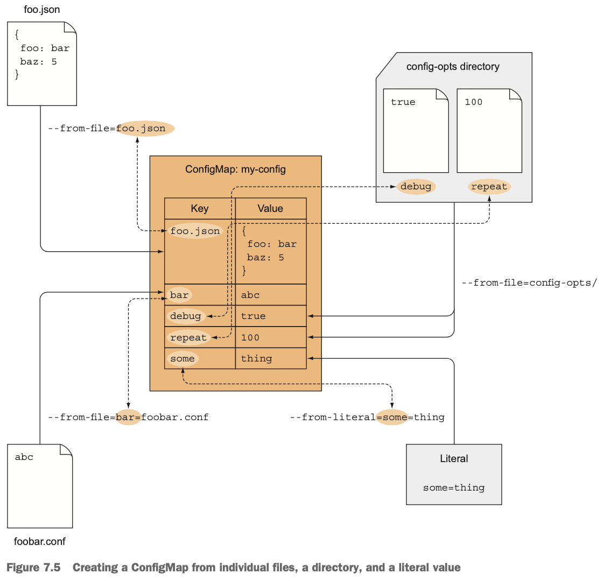

### 7.4.3 컨피그맵 항목을 환경변수로 컨테이너에 전달

- valueFrom 필드 사용

```yaml
apiVersion: v1
kind: Pod
metadata:
	name: fortune-env-from-configmap
spec:
	containers:
	- image: luksa/fortune:env
		env:
		- name: INTERVAL
			valueFrom:
				configMapKeyRef:
					name: fortune-config
					key: sleep-interval
...
```

- fortune-config 컨피그맵 안에 있는 sleep-interval 키를 이용해 가져온 값으로 설정

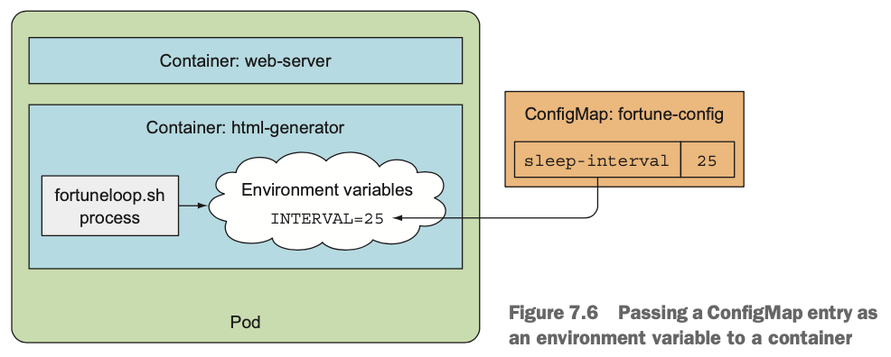

#### 파드에 존재하지 않는 컨피그맵 참조

- 파드를 스케줄링하고 파드 내 컨테이너 실행 시 존재하지 않는 컨피그맵을 참조하는 컨테이너는 시작 실패
- 존재하지 않는 컨피그맵을 참조하지 않는 컨테이너는 정상 시작
- 누락된 컨피그맵 생성 시 실패했던 컨테이너 시작됨

<aside>
ℹ️ 컨피그맵 참조를 옵션으로 표시(configMapKeyRef.optional: true)하여 컨피그맵이 존재하지 않아도 컨테이너가 시작되도록 설정 가능
</aside>

### 7.4.4 컨피그맵의 모든 항목을 한 번에 환경변수로 전달

- env 속성 대신 envFrom 속성을 사용해 컨피그맵의 모든 항목을 환경변수로 노출 가능

```yaml
spec:
	containers:
	- image: some-image
		envFrom:
		- prefix: CONFIG_
			configMapRef:
				name: my-config-map
...
```

- my-config-map이란 이름의 컨피그맵 참조, CONFIG_ 접두사를 가진 환경변수로 노출

<aside>
ℹ️ 접두사는 선택 사항, 생략 시 환경변수의 이름은 키와 동일
</aside>

- 컨피그맵에서 대시를 포함한 키는 환경변수 이름으로 유효하지 않기 때문에 환경변수로 노출되지 않음
  - 즉, 컨피그맵의 키가 올바른 형식이 아닌 경우 항목을 건너뜀(이벤트로 기록됨)

### 7.4.5 컨피그맵 항목을 명령줄 인자로 전달

- pod.spec.containers.args 필드에서 직접 참조 불가
- 컨피그맵 항목을 환경변수로 먼저 초기화한 뒤, 변수를 인자로 참조하도록 지정

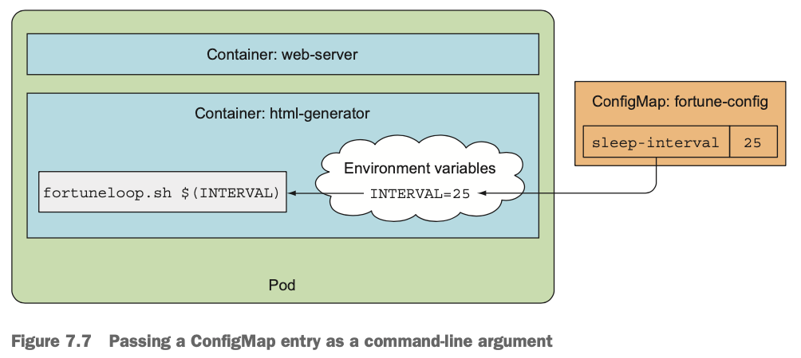

```yaml
apiVersion: v1
kind: Pod
metadata:
	name: fortune-args-from-configmap
spec:
	containers:
	- image: luksa/fortune:args
		env:
		- name: INTERVAL
			valueFrom:
				configMapKeyRef:
					name: fortune-config
					key: sleep-interval
		args: ["$(INTERVAL)"]
...
```

- 컨피그맵에서 환경변수를 정의하고, 정의된 환경변수를 인자에 지정
- $(ENVVARIABLENAME) 문법을 사용해 해당 변수의 값을 인자에 주입

### 7.4.6 컨피그맵 볼륨을 사용해 컨피그맵 항목을 파일로 노출

- 컨피그맵은 모든 설정 파일을 포함할 수 있으며, 이 파일들을 컨테이너에 노출시키기 위해서 컨피그맵 볼륨 사용 가능
- 일반적으로 대형 설정 파일들을 컨테이너에 전달하기 위해 사용

#### 컨피그맵 생성

- 클라이언트로 응답 시 압축해서 보내는 Nginx 설정

```
server {
	listen             80;
	server_name        www.kubia-example.com;

	gzip on;
	gzip_types text/plain application/xml;

	location / {
		root   /usr/share/nginx/html;
		index  index.html index.htm;
	}
}
```

- kubectl delete configmap fortune-config 명령으로 기존 컨피그맵 삭제
- configmap-file 디렉토리에 my-ngnix-config.conf 저장 및 일반 텍스트 25가 저장된 sleep-interval 파일 생성

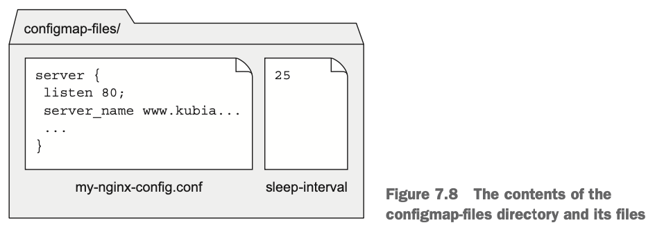

```shell
$ kubectl create configmap fortune-config --from-file=configmap-files
```

```yaml
apiVersion: v1
data:
	my-nginx-config.conf: |
		server {
			listen              80;
			server_name         www.kubia-example.com;

			gzip on;
			gzip_types text/plain application/xml;

			location / {
				root   /usr/share/nginx/html;
				index  index.html index.htm;
			}
		}
	sleep-interval: |
		25
kind: ConfigMap
...
```

<aside>
ℹ️ 파이프라인(|) 문자는 여러 줄의 문자열이 이어진다는 것을 뜻함
</aside>

#### 볼륨 안에 있는 컨피그맵 항목 사용

- Nginx는 /etc/nginx/nginx.conf 파일의 설정을 읽고 /etc/nginx/conf.d/ 디렉터리 내 모든 .conf 파일을 기본 설정 파일로 포함하므로, nginx.conf 파일의 기본 옵션을 사용하면서 추가 설정을 사용하기 위해 /etc/nginx/conf.d/ 디렉터리에 원하는 설정 파일 추가

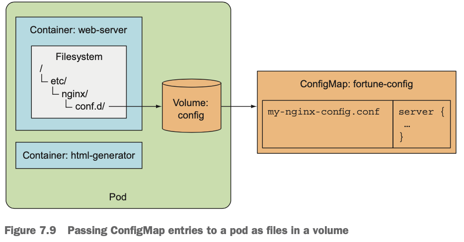

```yaml
apiVersion: v1
kind: Pod
metadata:
	name: fortune-configmap-volume
spec:
	containers:
	- image: nginx:alpine
		name: web-server
		volumeMounts:
		...
		- name: config
			mountPath: /etc/nginx/conf.d
			readOnly: true
		...
	volumes:
	...
	- name: config
		configMap:
			name: fortune-config
...
```

- fortune-config 컨피그맵을 참조하는 볼륨이 포함되어 있으며, /etc/nginx/conf.d 디렉터리로 마운트함

#### Nginx 서버가 마운트한 설정 파일을 사용하는지 확인

- [localhost:8080](http://localhost:8080)을 파드의 80포트로 포워딩 후 curl 명령으로 서버 응답 확인

```shell
$ kubectl port-forward fortune-configmap-volume 8080:80 &
$ curl -H "Accept-Encoding: gzip" -I localhost:8080
```

#### 마운트된 컨피그맵 볼륨 내용 살펴보기

```shell
$ kubectl exec fortune-configmap-volume -c web-server ls /etc/nginx/conf.d
```

#### 볼륨에 특정 컨피그맵 항목 노출

- 컨피그맵 볼륨을 컨피그맵 항목의 일부만 채우는 것 가능

```yaml
volumes:
- name: config
	configMap:
		name: fortune-config
		items:
			- key: my-nginx-config.conf
				path: gzip.conf
```

- my-nginx-config.conf 키 아래 항목만 gzip.conf 파일에 저장하여 볼륨에 포함

#### 디렉터리를 마운트할 때 디렉터리의 기존 파일을 숨기는 것 이해

- 볼륨을 디렉터리에 마운트할 경우 컨테이너 이미지 자체 디렉터리 내 파일은 숨겨짐
- 일반적으로 리눅스에서 파일시스템을 비어 있지 않은 디렉터리에 마운트할 때 발생
- 해당 디렉터리는 마운트한 파일시스템에 있는 파일만 포함하고 원래 있던 파일은 접근 불가

<aside>
⚠️ 중요한 파일을 포함하는 디렉터리에 볼륨 마운트 시 컨테이너가 손상될 수 있음
</aside>

#### 디렉터리 안에 다른 파일을 숨기지 않고 개별 컨피그맵 항목을 파일로 마운트

- volumeMount에 subPath 속성으로 파일이나 디렉터리 하나를 볼륨에 마운트 가능

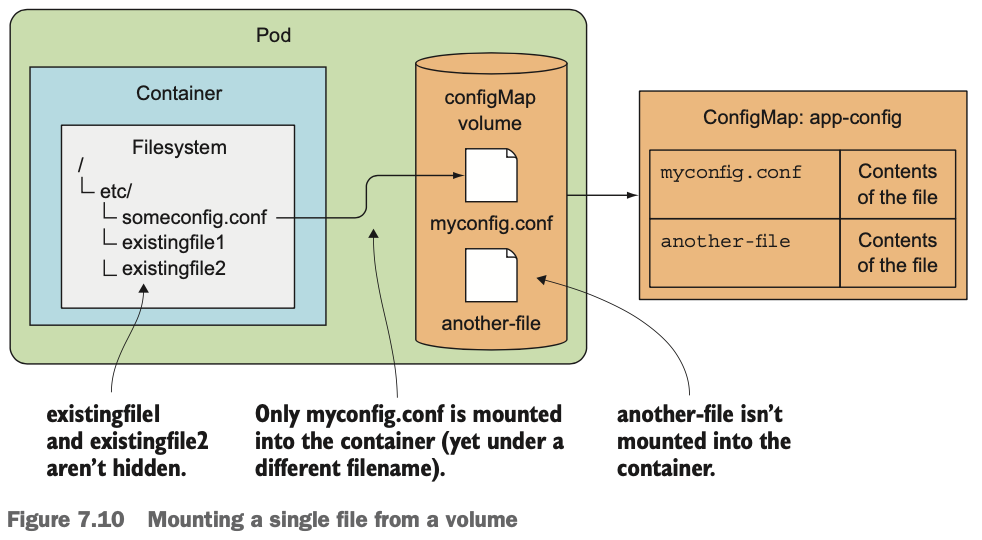

```yaml
spec:
	containers:
	- image: some/image
		volumeMounts:
		- name: myvolume
			mountPath: /etc/someconfig.conf
			subPath: myconfig.conf
```

- 디렉터리가 아닌 파일을 마운트하며, 전체 볼륨을 마운트하는 대신 myconfig.conf 항목만 someconfig.conf 파일로 추가하여 마운트

#### 컨피그맵 볼륨 안에 있는 파일 권한 설정

- 기본적으로 컨피그맵 볼륨의 모든 파일 권한은 644(-rw-r-r—)로 설정
- 볼륨 정의 안에 있는 defaultMode 속성을 설정해 변경 가능

```yaml

volumes:
- name: config
	configMap:
		name: fortune-config
		defaultMode: "6600"
```

### 7.4.7 애플리케이션을 재시작하지 않고 애플리케이션 설정 업데이트

- 컨피그맵 업데이트 시 이를 참조하는 모든 볼륨의 파일이 업데이트 됨
- 파일 업데이트 후 컨테이너에 신호를 보내는 것을 지원

<aside>
ℹ️ 컨피그맵 업데이트 후 파일이 업데이트되기까지 지연 시간 발생 가능(최대 1분)
</aside>

#### 컨피그맵 편집

- kubectl edit 명령으로 컨피그맵 편집

```shell
$ kubectl edit configmap fortune-config
```

- gzip on을 gzip off로 변경 후 저장
- kubectl exec 명령으로 확인

```shell
$ kubectl exec fortune-configmap-volume -c web-server
```

#### 설정을 다시 로드하기 위해 Nginx에 신호 전달

- 설정을 다시 로드하기 위해 명령 실행

```shell
$ kubectl exec fortune-configmap-volume -c web-server -- nginx -s reload
```

- 컨테이너 재시작 또는 파드 재생성 없이 애플리케이션 설정 변경

#### 파일이 한꺼번에 업데이트되는 방법 이해하기

- 컨피그맵이 업데이트되면 심볼릭링크가 가리킬 새 디렉터리 생성
- 모든 파일을 새로 생성한 디렉터리에 저장
- 심볼릭 링크가 새 디렉터리를 가리키도록 하여 모든 파일을 한 번에 효과적으로 변경

```shell
$ kubectl exec -it fortune-configmap-volume -c web-server -- ls -lA\
	/etc/nginx/conf.d
```

#### 이미 존재하는 디렉터리에 파일만 마운트했을 때 업데이트가 되지 않는 것 이해하기

- 전체 볼륨 대신 단일 파일을 컨테이너에 마운트(subPath 사용)한 경우 파일이 업데이트되지 않음
- 전체 볼륨을 다른 디렉터리에 마운트한 다음 해당 파일을 가리키는 심볼릭 링크를 생성하여 업데이트

#### 컨피그맵 업데이트의 결과 이해하기

- 애플리케이션이 설정을 자동으로 다시 읽는 기능을 가지고 있지 않은 경우
  - 컨피그맵 변경 이후 생성된 파드는 새로운 설정을 사용하지만 예전 파드는 계속해서 예전 설정 사용
  - 파드 재시작 시 새로운 프로세스는 새로운 설정을 사용
- 애플리케이션이 다시 읽기를 지원하는 경우
  - 컨피그맵 볼륨 파일이 실행 중인 모든 인스턴스에 걸쳐 동기적으로 업데이트되지 않기 때문에 동기화되지 않은 상태가 발생할 수 있음

## 7.5 시크릿으로 민감한 데이터를 컨테이너에 전달

- 보안이 유지되어야 하는 자격증명과 개인 암호화 키 같은 민감 정보 보관 및 배포

### 7.5.1 시크릿 소개

- 키-값 쌍을 가진 맵으로, 컨피그맵과 유사
- 컨피그맵과 같은 방식으로 사용 가능
  - 환경변수로 시크릿 항목을 컨테이너에 전달
  - 시크릿 항목을 볼륨 파일로 노출
- 시크릿에 접근해야 하는 파드가 실해오디고 있는 노드에만 개별 시크릿을 배포
- 항상 메모리에만 저장하고 물리 저장소에 기록되지 않음
- 마스터 노드(etcd)에는 시크릿을 암호화되지 않은 형식으로 저장하므로, 마스터 노드 보호 필요
  - 쿠버네티스 1.7부터 etcd가 시크릿을 암호화된 형태로 저장하도록 지원
- 시크릿 vs 컨피그맵
  - 민감하지 않고, 일반 설정 데이터는 컨피그맵 사용
  - 민감한 데이터는 시크릿을 사용해 키 아래 보관
  - 설정 파일이 민감한 데이터와 그렇지 않은 데이터를 모두 가지고 있을 경우 파일을 시크릿 안에 저장

### 7.5.2 기본 토큰 시크릿 소개

- 파드에 대해 kubectl describe 명령어 사용 시 시크릿 포함 내용 확인

```shell
volumes:
	default-token-cfee9:
		Type:       Secret (a volume populated by a Secret)
		SecretName: default-token-cfee9
```

- 모든 파드에는 secret 볼륨이 자동으로 연결됨

```shell
$ kubectl get secrets
```

```shell
$ kubectl describe secrets
```

- ca.crt, namespace, token 세 가지 항목은 파드 안에서 쿠버네티스 API 서버와 통신할 때 필요

```shell
$ kubectl describe pod
```

- 기본적으로 default-token 시크릿은 모든 컨테이너에 마운트됨
  - 파드 스펙 안에 automountService-AccountToken 필드 값을 false로 지정하거나 파드가 사용하는 서비스 어카운트를 false로 지정해 비활성화 가능

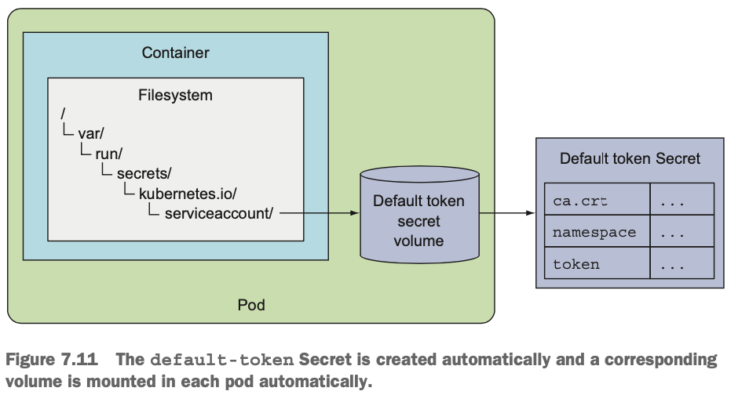

- kubectl exec 명령어로 secret 볼륨이 마운트된 디렉터리 확인

```shell
$ kubectl exec mypod ls /var/run/secret/kubernetes.io/serviceaccount/
```

### 7.5.3 시크릿 생성

```shell
$ openssl genrsa -out https.key 2048
$ openssl req -new -x509 -key https.key -out https.cert -days 3650 -subj\
	/CN=www.kubia-example.com
```

```shell
$ echo bar > foo
```

```shell
$ kubectl create secret generic fortune-https --from-file=https.key\
	--from-file=https.cert --from-file=foo
```

- fortune-https 이름을 가진 generic 시크릿 생성
- —from-file=fortune-https 옵션을 이용해 디렉터리 전체 포함 가능

<aside>
ℹ️ 시크릿의 세 가지 유형에는 도커 레지스트리를 사용하기 위한 docker-registry, TLS 통신을 위한 tls, generic이 있음
</aside>

### 7.5.4 컨피그맵과 시크릿 비교

```yaml
apiVersion: v1
data:
	foo: YmFyCg==
	https.cert: LS0tLS1CRUdJTiBDRVJUSUZJQ0FURS0tLS0tCk1JSURCekNDQ...
	https.key: LS0tLS1CRUdJTiBSU0EgUFJJVkFURSBLRVktLS0tLQpNSUlFcE...
kind: Secret
...
```

```yaml
apiVersion: v1
data:
	my-nginx-config.conf: |
		server {
			...
		}
	sleep-interval: |
		25
kind: ConfigMap
...
```

- 시크릿 항목의 내용은 Base64 인코딩 문자열로, 컨피그맵의 내용은 일반 텍스트로 표시

#### 바이너리 데이터 시크릿 사용

- 시크릿 항목에 일반 텍스트뿐만 아니라 바이너리 값도 담을 수 있음

<aside>
⚠️ 시크릿의 최대 크기는 1MB로 제한됨
</aside>

#### stringData 필드 소개

```yaml
kind: Secret
apiVersion: v1
stringData:
	foo: plain text
data:
	https.cert: LS0tLS1CRUdJTiBDRVJUSUZJQ0FURS0tLS0tCk1JSURCekNDQ...
	https.key: LS0tLS1CRUdJTiBSU0EgUFJJVkFURSBLRVktLS0tLQpNSUlFcE...
```

- 바이너리 데이터가 아닌 시크릿 데이터에 stringData 사용하며, "plain text"는 Base64로 인코딩되지 않음
- stringData 필드는 쓰기 전용이기 때문에 값을 설정할 때만 사용
- kubectl get -o yaml 명령으로 시크릿의 YAML 정의를 가져올 때 표시되지 않으며, data 항목 아래 다른 모든 항목처럼 Base64로 인코딩돼 표시

#### 파드에서 시크릿 항목 읽기

- secret 볼륨을 통해 시크릿을 컨테이너에 노출하면, 시크릿 항목의 값이 일반 텍스트인지 바이너리 데이터인지에 관계 없이 실제 형식으로 디코딩돼 파일에 기록
- 환경변수로 시크릿 항목 노출 시에도 동일
- 애플리케이션에서 디코딩할 필요 없이 사용

### 7.5.5 파드에서 시크릿 사용

#### HTTPS를 활성화하도록 fortune-config 컨피그맵 수정

```yaml
...
data:
	my-nginx-config.conf: |
		server {
			listen             80;
			listen             443 ssl;
			server_name        www.kubia-example.com;
			ssl_certificate     certs/https.cert;
			ssl_certificate_key certs/https.key;
			ssl_protocols      TLSv1 TLSv1.1 TLSv1.2;
			ssl_ciphers        HIGH:!aNull:!MD5;
			location / {
				root   /usr/share/nginx/html;
				index  index.html index.htm;
			}
		}
	sleep-interval: |
...
```

- 각 경로는 /etc/nginx를 기준으로 지정

#### fortune-https 시크릿을 파드에 마운트

```yaml
apiVersion: v1
kind: Pod
metadata:
	name: fortune-https
spec:
	containers:
	- image: luksa/fortune:env
		name: http-generator
		env:
		- name: INTERVAL
			valueFrom:
				configMapKeyRef:
					name: fortune-config
					key: sleep-interval
		volumeMounts:
		- name: html
			mountPath: /var/htdocs
	- image: nginx:alpine
		name: web-server
		volumeMounts:
		- name: html
			mountPath: /usr/share/nginx/html
			readOnly: true
		- name: config
			mountPath: /etc/nginx/conf.d
			readOnly: true
		- name: certs
			mountPath: /etc/nginx/certs/
			readOnly: true
		ports:
		- containerPort: 80
		- containerPort: 443
	volumes:
	- name: html
		emptyDir: {}
	- name: config
		configMap:
			name: fortune-config
			items:
			- key: my-nginx-config.conf
				path: https.conf
	- name: certs
		secret:
			secretName: fortune-https
```

- Nginx 서버가 인증서와 키를 /etc/nginx/certs에서 읽도록 설정했으므로 시크릿 볼륨을 해당 위치에 마운트
- fortune-https 시크릿을 참조하도록 시크릿 볼륨 정의

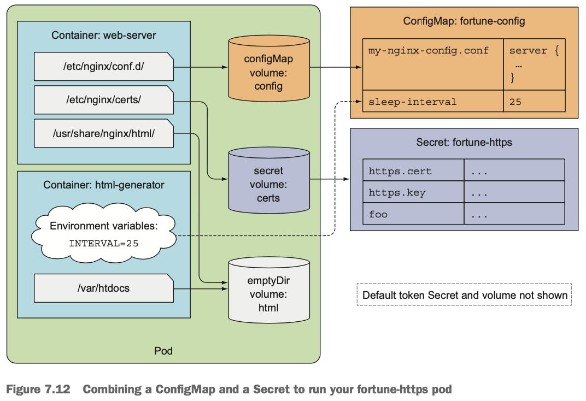

<aside>
ℹ️ secret 볼륨도 defaultMode 속성을 통해 볼륨에 노출된 파일 권한 지정 가능
</aside>

#### Nginx가 시크릿의 인증서와 키를 사용하는지 테스트

```shell
$ kubectl port-forward fortune-https 8443:443 &
$ curl https://localhost:8443 -k
```

```shell
$ curl https://localhost:8443 -k -v
```

#### 시크릿 볼륨을 메모리에 저장하는 이유

- 시크릿 파일 저장 시 민감한 데이터를 디스크에 저장하지 않기 위해 인메모리 파일시스템(tmpfs) 사용

```shell
$ kubectl exec fortune-https -c web-server -- mount | grep certs
```

#### 환경변수로 시크릿 항목 노출

```yaml
env:
- name: FOO_SECRET
	valueFrom:
		secretKeyRef:
			name: fortune-https
			key: foo
```

- 환경변수로 시크릿을 컨테이너에 전달 시 의도치 않은 노출 발생 가능
  - 안전을 위해 시크릿 노출 시 항상 secret 볼륨 사용 권고

### 7.5.6 이미지를 가져올 때 사용하는 시크릿 이해

- 컨테이너 이미지가 프라이빗 이미지 레지스트리 안에 있는 경우 자격증명 전달 필요

#### 도커 허브에서 프라이빗 이미지 사용

- 도커 레지스트리 자격증명을 가진 시크릿 생성
- 파드 매니페스트 안에 imagePullSecrets 필드에 해당 시크릿 참조

#### 도커 레지스트리 인증을 위한 시크릿 생성

```shell
$ kubectl create secret docker-registry mydockerhubsecret \
	--docker-username=myusername --docker-password=mypassword \
	--docker-email=my.email@provider.com
```

#### 파드 정의에서 도커 레지스트리 시크릿 사용

```yaml
apiVersion: v1
kind: Pod
metadata:
	name: private-pod
spec:
	imagePullSecrets:
	- name: mydockerhubsecret
	containers:
	- image: username/private:tag
		name: main
```

- mydockerhubsecret 시크릿을 imagePullSecrets 항목으로 지정

#### 모든 파드에서 이미지를 가져올 때 사용할 시크릿을 모두 지정할 필요는 없다

- 시크릿을 서비스어카운트에 추가해 모든 파드에 자동으로 추가될 수 있게 설정 가능

### 번외

#### 변경할 수 없는(immutable) 컨피그맵

- 쿠버네티스 기능인 변경할 수 없는 시크릿과 컨피그맵은 개별 시크릿과 컨피그맵을 변경할 수 없는 것으로 설정하는 옵션 제공
- 컨피그맵을 광범위하게 사용하는 클러스터(최소 수 만 개의 고유한 컨피그맵이 파드에 마운트)의 경우 데이터 변경을 방지하면 다음과 같은 이점이 있음
  - 애플리케이션 중단을 일으킬 수 있는 우발적(또는 원하지 않는) 업데이트로부터 보호
  - immutable로 표시된 컨피그맵에 대한 감시를 중단하여, kube-apiserver의 부하를 크게 줄임으로써 클러스터의 성능을 향상시킴

### Q. Helm-values로 관리되는 환경변수와 컨피그맵으로 관리되는 환경변수가 있는데 어떤 차이가 있는지?

- [https://www.reddit.com/r/kubernetes/comments/jlovje/helm_valuesyaml_vs_kubernetes_configmaps/](https://www.reddit.com/r/kubernetes/comments/jlovje/helm_valuesyaml_vs_kubernetes_configmaps/)
- Helm-values는 컨피그맵을 포함하는 개념
- 컨피그맵은 설정과 애플리케이션을 분리하는 목적