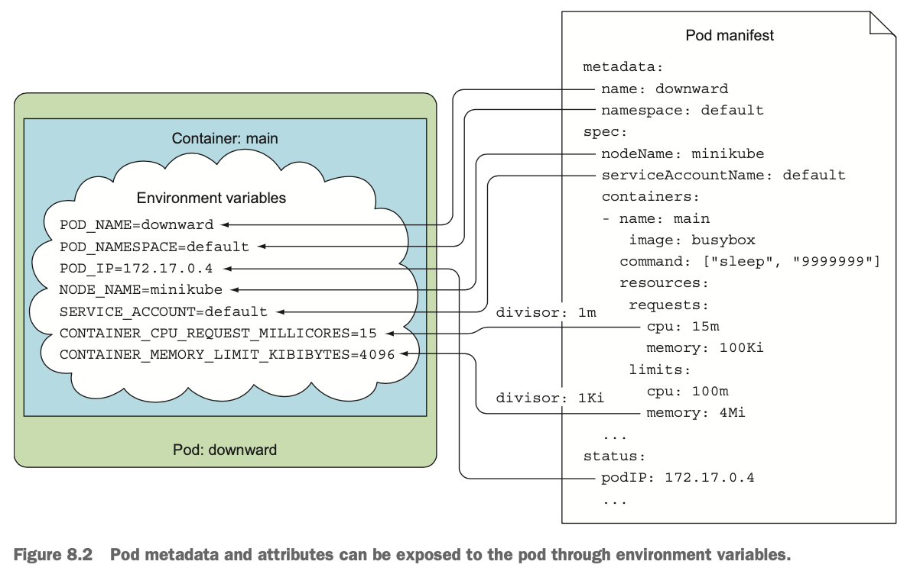

# 8장 애플리케이션에서 파드 메타데이터와 그 외의 리소스에 액세스하기

## 8.1 Downward API로 메타데이터 전달

- Downward API를 이용해 파드의 IP, 호스트 노드 이름 또는 파드 자체의 이름과 같이 실행 시점까지 알려지지 않은 데이터, 파드의 레이블이나 어노테이션과 같이 어딘가에 이미 설정된 데이터를 애플리케이션에 전달
- 환경변수 또는 (downwardAPI 볼륨 내에 있는) 파일로 파드와 해당 환경의 메타데이터 전달
- 애플리케이션이 호출해서 데이터를 가져오는 REST 엔드포인트가 아닌 환경변수 또는 파일에 파드의 스펙 또는 상태값이 채워지도록 하는 방식


### 8.1.1 사용 가능한 메타데이터 이해

- Downward API를 사용하여 파드 자체의 메타데이터를 해당 파드 내에 실행 중인 프로세스에 노출
  - 파드의 이름
  - 파드의 IP 주소
  - 파드가 속한 네임스페이스
  - 파드가 실행 중인 노드 이름
  - 파드가 실행 중인 서비스 어카운트 이름(12장 참고)
  - 각 컨테이너의 CPU와 메모리 요청(14장 참고)
  - 각 컨테이너의 CPU와 메모리 제한(14장 참고)
  - 파드의 레이블
  - 파드의 어노테이션
- 대부분의 항목은 환경변수 또는 downwardAPI 볼륨으로 컨테이너에 전달 가능하지만, 레이블과 어노테이션은 볼륨으로만 노출 가능

### 8.1.2 환경변수로 메타데이터 노출하기

```yaml
apiVersion: v1
kind: Pod
metadata:
	name: downward
spec:
	containers:
	- name: main
		image: busybox
		command: ["sleep", "9999999"]
		resources:
			requests:
				cpu: 15m
				memory: 100Ki
			limits:
				cpu: 100m
				memory: 4Mi
		env:
		- name: POD_NAME
			valueFrom:
				fieldRef:
					fieldPath: metadata.name
		- name: POD_NAMESPACE
			valueFrom:
				fieldRef:
					fieldPath: metadata.namespace
		- name: POD_IP
			valueFrom:
				fieldRef:
					fieldPath: status.podIP
		- name: NODE_NAME
			valueFrom:
				fieldRef:
					fieldPath: spec.nodeName
		- name: SERVICE_ACCOUNT
			valueFrom:
				fieldRef:
					fieldPath: spec.serviceAccountName
		- name: CONTAINER_CPU_REQUEST_MILLICORES
			valueFrom:
				resourceFieldRef:
					resource: requests.cpu
					divisor: 1m
		- name: CONTAINER_MEMORY_LIMIT_KIBIBYTES
			valueFrom:
				resourceFieldRef:
					resource: limits.memory
					divisor: 1Ki
```

- 파드 스펙에 정의한 환경변수로 노출
  - POD_NAME: 파드의 이름
  - POD_IP: 파드 IP
  - POD_NAMESPACE: 파드 네임스페이스
  - NODE_NAME: 컨테이너가 실행 중인 노드 이름
  - SERVICE_ACCOUNT: 서비스 어카운트
- 자원 제한 또는 요청을 노출시키는 환경변수의 경우 제수 지정
  - CONTAINER_CPU_REQUEST_MILLICORES: CPU 요청은 15m, CPU 요청에 대한 제수는 1m이므로 15
  - CONTAINER_MEMORY_LIMIT_KIBIBYTES: 메모리 제한은 4Mi, 제수는 1Ki이므로 4096
  - CPU 제한/요청의 제수: 1(전체 코어 하나 의미) 또는 1m(1밀리코어)로 설정
  - 메모리 제한/요청의 제수: 1(바이트), 1k(킬로바이트) 또는 1Ki(키비바이트), 1M(메가바이트) 또는 1Mi(메비바이트) 등 설정



```shell
$ kubectl exec downward env
```

### 8.1.3 downwardAPI 볼륨에 파일로 메타데이터 전달

- downwardAPI 볼륨을 정의해 컨테이너에 마운트하여 환경변수 대신 파일로 메타데이터 노출 가능

<aside>
⚠️ 환경변수로 파드의 레이블이나 어노테이션을 노출할 수 없어 downwardAPI 볼륨 사용
</aside>

```yaml
apiVersion: v1
kind: Pod
metadata:
  name: downward
  labels:
    foo: bar
  annotations:
    key1: value1
    key2: |
        multi
        line
        value
spec:
  containers:
  - name: main
      image: busybox
      command: ["sleep", "9999999"]
      resources:
        requests:
          cpu: 15m
          memory: 100Ki
        limits:
          cpu: 100m
          memory: 4Mi
      volumeMounts:
      - name: downward
          mountPath: /etc/downward
	volumes:
	- name: downward
		downwardAPI:
          items:
          - path: "podName"
              fieldRef:
                fieldPath: metadata.name
          - path: "podNamespace"
              fieldRef:
                fieldPath: metadata.namespace
          - path: "labels"
              fieldRef:
                fieldPath: metadata.labels
          - path: "annotations"
              fieldRef:
                fieldPath: metadata.annotations
          - path: "containerCpuRequestMilliCores"
              resourceFieldRef:
                containerName: main
                resource: request.cpu
                divisor: 1m
          - paht: "containerMemoryLimitBytes"
              resourceFieldRef:
                containerName: main
                resource: limits.memory
                divisor: 1
```

- 환경변수로 메타데이터를 전달하는 대신 downward라는 볼륨을 정의하고 컨테이너의 /etc/downward 아래 마운트
- 볼륨에 포함된 파일들은 볼륨 스펙의 downwardAPI.items 속성 아래 설정
  - /etc/downward/podName 파일: 파드의 이름(metadata.name 필드) 기록
  - /etc/downward/labels 파일: 파드의 레이블 기록
  - /etc/downward/annotations 파일: 파드의 어노테이션 기록


- 이전에 만든 파드를 삭제하고 이전 예제의 매니페스트를 사용해 새로운 파드 생성 후 파일 확인

```shell
$ kubectl exec downward -- ls -lL /etc/downward
```

<aside>
ℹ️ 컨피그맵과 시크릿 볼륨과 마찬가지로 파드 스펙에서 downwardAPI 볼륨의 defaultMode 속성으로 파일 권한 변경 가능
</aside>

```shell
$ kubectl exec downward cat /etc/downward/labels
$ kubectl exec downward cat /etc/downward/annotations
```

#### 레이블과 어노테이션 업데이트

- 파드가 실행되는 동안 레이블과 어노테이션 수정 가능하며, 변경 시 이 값을 가지고 있는 파일을 업데이트
- 환경변숫값은 나중에 업데이트할 수 없기 때문에 파드의 레이블 또는 어노테이션이 환경변수로 노출된 경우 변경이 발생한 다음에 새로운 값을 노출할 수 있는 방법이 없음

#### 볼륨 스펙에서 컨테이너 수준의 메타데이터 참조

- 컨테이너 수준의 메타데이터 노출 시 리소스 필드를 참조하는 컨테이너 이름으로 지정

```yaml
spec:
  volumes:
  - name: downward
      downwardAPI:
        items:
        - path: "containerCpuRequestMilliCores"
            resourceFieldRef:
              containerName: main
              resource: requests.cpu
              divisor: 1m
```

- 한 컨테이너의 리소스 필드를 다른 컨테이너에 전달할 수 있음(단, 두 컨테이너는 같은 파드에 존재해야 함)
- 환경변수를 사용할 경우 컨테이너 자신의 리소스 제한과 요청만 전달 가능

#### Downward API 사용 시기 이해

- 애플리케이션을 쿠버네티스에 독립적으로 유지할 수 있게 함
- 애플리케이션을 다시 짜거나 데이터를 가져와서 환경변수에 노출하는 셸 스크립트를 사용하지 않아도 됨
- 사용 가능한 메타데이터가 제한적이기 때문에 더 많은 정보가 필요할 경우 쿠버네티스 API 서버에서 직접 가져와야 함

## 8.2 쿠버네티스 API 서버와 통신하기

- 애플리케이션이 다른 리소스 정보가 필요하거나 가능한 한 최신 정보에 접근해야 하는 경우 API 서버와 통신


### 8.2.1 쿠버네티스 REST API 살펴보기

```shell
$ kubectl cluster-info
```

- HTTPS를 사용하고 인증이 필요하기 때문에 curl —insecure(또는 -k) 옵션을 사용할 수 없으며 kubectl proxy 명령을 실행해 프록시로 통신해야 함

#### kubectl 프록시로 API 서버 액세스하기

- 프록시 서버를 실행해 로컬 컴퓨터에서 HTTP 연결을 수신하고, 이 연결에 대한 인증을 관리하면서 API 서버로 전달
- 요청 시마다 인증 토큰을 전달할 필요 없음
- 각 요청마다 서버의 인증서를 확인해 실제 API 서버와의 통신을 보장

```shell
$ kubectl proxy
```

- kubectl은 API 서버 URL, 인증 토큰 등을 이미 알고 있으므로 별도의 인자 필요 없음
- 프록시는 로컬 포트 8001에서 연결 수신

```shell
$ curl localhost:8001
```

#### kubectl proxy로 쿠버네티스 API 살펴보기

```shell
$ curl http://localhost:8001
{
  "paths": [
    "/api",
    "/api/v1",
    "/apis",
    "/apis/apps",
    "/apis/apps/v1beta1",
    ...
    "/apis/batch",
    "/apis/batch/v1",
    "/apis/batch/v2alpha1",
    ...
```

- 경로는 리소스 정의에 지정한 API 그룹과 버전에 해당

<aside>
ℹ️ API 그룹이 없는 리소스 유형은 core API 그룹에 속하는 것으로 간주
</aside>

#### 배치 API 그룹의 REST 엔드포인트 살펴보기

```shell
$ curl http://localhost:8001/apis/batch
{
  "kind": "APIGroup",
  "apiVersion": "v1",
  "name": "batch",
  "versions": [
    {
      "groupVersion": "batch/v1",
      "version": "v1"
		},
		{
      "groupVersion": "batch/v2alpha1",
      "version": "v2alpha1"
    }
  ],
  "preferredVersion": {
    "groupVersion": "batch/v1",
    "version": "v1"
  },
  "serverAddressByClientCIDRs": null
}
```

- 사용 가능한 버전과 클라이언트가 사용해야 하는 선호 버전에 관한 정보, batch API 그룹에 관한 설명 표시

```shell
$ curl http://localhost:8001/apis/batch/v1
{
  "kind": "APIResourceList",
  "apiVersion": "v1",
  "groupVersion": "batch/v1",
  "resources": [
		{
			"name": "jobs",
			"namespaced": true,
			"kind": "Job",
			"verbs": [
			  "create",
			  "delete",
			  "deletecollection",
			  "get",
				"list",
		    "patch",
		    "update",
		    "watch"
			]
		},
    {
      "name": "jobs/status",
      "namespaced": true,
      "kind": "Job",
      "verbs": [
        "get",
        "patch",
        "update"
			]
		}
	]
}
```

- batch/v1 API 그룹에서 리소스 유형 및 REST 엔드포인트 목록 반환
- 리소스에 네임스페이스가 지정되었는지(namespaced) 여부, 짧은 이름과 해당 리소스에 사용할 수 있는 동사(verbs) 목록 표시

#### 클러스터에 있는 모든 잡 인스턴스 나열하기

```shell
$ curl http://localhost:8001/apis/batch/v1/jobs
{
  "kind": "JobList",
  "apiVersion": "batch/v1",
  "metadata": {
    "selfLink": "/apis/batch/v1/jobs",
    "resourceVersion": "225162"
  },
	"items": [
		{
      "metadata": {
        "name": "my-job",
        "namespace": "default",
        ...
```

<aside>
ℹ️ 클러스터에 잡 리소스가 배포되어 있지 않기 때문에 items 배열이 비어 있을 경우 Chapter08/my-job.yaml 배포 후 확인
</aside>

#### 이름별로 특정 잡 인스턴스 검색

```shell
$ curl https://localhost:8001/apis/batch/v1/namespaces/default/jobs/my-job
{
  "kind": "Job",
  "apiVersion": "batch/v1",
  "metadata": {
    "name": "my-job",
    "namespace": "default",
    ...
```

- kubectl get job my-job -o json 명령을 실행한 것과 동일하게 JSON 정의를 얻을 수 있음

### 8.2.2 파드 내에서 API 서버와 통신

- 파드 내부에서 API 서버와 통신하기 위해 처리해야 할 것
  - API 서버의 위치를 찾아야 함
  - API 서버와 통신하고 있는지 확인해야 함
  - API 서버로 인증해야 함

#### API 서버와의 통신을 시도하기 위해 파드 실행

```yaml
apiVersion: v1
kind: Pod
metadata:
	name: curl
spec:
	containers:
	- name: main
		image: tutum/curl
		command: ["sleep", "9999999"]
```

```shell
$ kubectl exec -it curl bash
```

#### API 서버 주소 찾기

```shell
$ kubectl get svc
NAME         CLUSTER-IP   EXTERNAL-IP   PORT(S)   AGE
kubernetes   10.0.0.1     <none>        443/TCP   46d
```

```shell
root@curl:/# env | grep KUBERNETES_SERVICE
KUBERNETES_SERVICE_PORT=443
KUBERNETES_SERVICE_HOST=10.0.0.1
KUBERNETES_SERVICE_PORT_HTTPS=443
```

- 각 서비스마다 DNS 엔트리가 있으므로 curl에서 [https://kubernetes를](https://kubernetes를) 가리키거나, DNS SRV 레코드 조회하여 확인

```shell
root@curl:/# curl https://kubernetes
curl: (60) SSL certificate problem: unable to get local issuer certificate
...
If you'd like to turn off curl's verification of the certificate, use
  the -k (or --insecure) option.
```

- -k 옵션을 사용하여 인증서 확인 없이 접속할 수 있으나, 연결하려는 서버가 인증된 API 서버인지 curl로 검사해 확인

<aside>
⚠️ 서버 인증서 확인을 건너뛸 경우 중간자 공격으로 애플리케이션의 인증 토큰이 공격자에게 노출될 수 있음
</aside>

#### 서버의 아이덴티티 검증

- 각 컨테이너의 /var/run/secrets/kubernetes.io/serviceaccount/에 마운트되는 자동으로 생성된 default-token-xyz 시크릿 내 ca.crt 인증서 파일을 이용하여 API 서버의 인증서가 CA로 서명됐는지 확인

```shell
root@curl:/# curl --cacert /var/run/secrets/kubernetes.io/serviceaccount/ca.crt https://kubernetes
Unauthorized
```

- 서버의 인증서를 신뢰할 수 있는 CA가 서명했기 때문에 curl이 서버의 ID를 확인했으나 인증 처리 필요
- CURL_CA_BUNDLE 환경변수를 설정해 —cacert 지정 없이 curl 사용가능

```shell
root@curl:/# export CURL_CA_BUNDLE=/var/run/secrets/kubernetes.io/serviceaccount/ca.crt
```

#### API 서버로 인증

- 인증에 필요한 인증 토큰은 default-token 시크릿으로 제공되며, 시크릿 볼륨의 token 파일에 저장됨

```shell
root@curl:/# TOKEN=$(cat /var/run/secrets/kubernetes.io/serviceaccount/token)
```

```shell
root@curl:/# curl -H "Authorization: Bearer $TOKEN" https://kubernetes
{
	"paths": [
	    "/api",
	    "/api/v1",
	    "/apis",
	    "/apis/apps",
	    "/apis/apps/v1beta1",
	    "/apis/authorization.k8s.io",
	    ...
		"/ui/",
		"/version"
	]
}
```

<aside>
⚠️ 역할 기반 액세스 제어(RBAC)가 활성화된 쿠버네티스 클러스터를 사용하는 경우 서비스 어카운트가 API 서버에 액세스할 권한이 없을 수 있으며 다음 명령을 실행해 RBAC 우회 가능

```shell
$ kubectl create clusterrolebinding permissive-binding \
	--clusterrole=cluster-admin \
	--group=system:serviceaccounts
```

모든 서비스 어카운트에 클러스터 관리자 권한이 부여되므로 프로덕션 클러스터에서는 사용하지 말아야 함

</aside>

#### 파드가 실행 중인 네임스페이스 얻기

- 시크릿 볼륨에 네임스페이스라는 파일이 포함되어 있으며, 파일 내용을 NS 환경변수에 로드하여 사용 가능

```shell
root@curl:/# NS=$(cat /var/run/secrets/kubernetes.io/serviceaccount/namespace)
root@curl:/# curl -H "Authorization: Bearer $TOKEN" https://kubernetes/api/v1/namespace/$NS/pods
{
  "kind": "PodList",
  "apiVersion": "v1",
  ...
```

#### 파드가 쿠버네티스와 통신하는 방법 정리

- API 서버의 인증서가 인증 기관으로부터 서명됐는지 ca.crt 파일로 검증
- token 파일의 내용을 Authorization HTTP 헤더에 Bearer 토큰으로 넣어 전송해서 인증 필요
- namespace 파일은 파드의 네임스페이스 안에 있는 API 오브젝트의 CRUD 작업 수행 시 전달


### 8.2.3 앰배서더 컨테이너를 이용한 API 서버 통신 간소화

- 파드 내에서도 API 서버로 직접 요청을 보내는 대신 프록시로 요청을 보내 인증, 암호화 및 서버 검증을 처리할 수 있음

#### 앰배서더 컨테이너 패턴 소개

- 메인 컨테이너 옆의 앰배서더 컨테이너에서 kubectl proxy를 실행하고 API와 통신 가능
- 메인 컨테이너의 애플리케이션은 HTTP로 앰배서더에 연결하고 앰배서더 프록시가 시크릿 볼륨에 있는 default-token 파일을 사용해 API 서버에 대한 HTTPS 연결 처리


- 파드의 모든 컨테이너는 동일한 루프백 네트워크 인터페이스를 공유, localhost의 포트로 프록시 액세스 가능

#### 추가적인 앰배서더 컨테이너를 사용한 curl 파드 실행

```yaml
apiVersion: v1
kind: Pod
metadata:
	name: curl-with-ambassador
spec:
	containers:
	- name: main
		image: tutum/curl
		command: ["sleep", "9999999"]
	- name: ambassador
		image: luksa/kubectl-proxy:1.6.2
```

- 앰배서더 컨테이너가 추가된 파드 실행 후 main 컨테이너 셸 실행

```shell
$ kubectl exec -it curl-with-ambassador -c main bash
```

#### 앰배서더를 통한 API 서버와의 통신

- 기본적으로 kubectl proxy는 포트 8001에 바인딩되며, 파드의 두 컨테이너 모두 동일한 네트워크 인터페이스를 공유하므로 localhost:8001에 접속 가능

```shell
root@curl-with-ambassador:/# curl localhost:8001
{
	"paths": [
		"/api",
		...
	]
}
```

- curl은 (인증 헤더 없이) 일반 HTTP 요청을 앰배서더 컨테이너 내에서 실행 중인 프록시로 전송
- 프록시는 HTTPS 요청을 API 서버로 전송, 토큰을 전송해 클라이언트 인증 처리 및 서버 인증서 검증


- 외부 서비스에 연결하는 복잡성을 숨기고 메인 컨테이너에서 실행되는 애플리케이션을 단순화하기 위해 앰배서더 컨테이너 사용
- 앰배서더 컨테이너 사용으로 추가 프로세스가 실행되고 추가 리소스가 소비됨

### 8.2.4 클라이언트 라이브러리를 사용해 API 서버와 통신

- 복잡한 요청을 수행하기 위해 쿠버네티스 API 클라이언트 라이브러리 사용

#### 클라이언트 라이브러리 사용

- API Machinery SIG(Special Interest Group)에서 지원하는 Kubernetes API 클라이언트 라이브러리
  - Golang 클라이언트: [https://github.com/kubernetes/client-go](https://github.com/kubernetes/client-go)
  - Python: [https://github.com/kubernetes-incubator/client-python/](https://github.com/kubernetes-incubator/client-python/)
- 쿠버네티스의 특정 영역에 초점을 맞춘 다수의 SIG와 워킹 그룹
  - [https://github.com/kubernetes/community/blob/master/sig-list.md](https://github.com/kubernetes/community/blob/master/sig-list.md)
- 그 외 다른 언어에 관한 사용자 제공 클라이언트 라이브러리 존재
- 일반적으로 HTTPS를 지원하고 인증을 관리하므로 앰배서더 컨테이너 사용 필요 없음

#### Fabric8 Java Client를 사용한 쿠버네티스와의 상호작용 예시

```java
import java.util.Arrays;
import io.fabric8.kubernetes.api.model.Pod;
import io.fabric8.kubernetes.api.model.PodList;
import io.fabric8.kubernetes.client.DefaultKubernetesClient;
import io.fabric8.kubernetes.client.KubernetesClient;

public class Test {
  public static void main(String[] args) throws Exception {
    KubernetesClient client = new DefaultKubernetesClient();

    // list pods in the default namespace
    PodList pods = client.pods().inNamespace("default").list();
    pods.getItems().stream()
      .forEach(s -> System.out.println("Found pod: " +
               s.getMetadata().getName()));

    // create a pod
    System.out.println("Creating a pod");
    Pod pod = client.pods().inNamespace("default")
      .createNew()
      .withNewMetadata()
        .withName("programmatically-created-pod")
      .endMetadata()
      .withNewSpec()
        .addNewContainer()
          .withName("main")
          .withImage("busybox")
          .withCommand(Arrays.asList("sleep", "99999"))
        .endContainer()
      .endSpec()
      .done();
    System.out.println("Created pod: " + pod);

    // edit the pod (add a label to it)
    client.pods().inNamespace("default")
      .withName("programmatically-created-pod")
      .edit()
      .editMetadata()
				.addToLabels("foo", "bar")
      .endMetadata()
      .done();
    System.out.println("Added label foo=bar to pod");
    System.out.println("Waiting 1 minute before deleting pod...");
    Thread.sleep(60000);

    // delete the pod
    client.pods().inNamespace("default")
      .withName("programmatically-created-pod")
      .delete();
    System.out.println("Deleted the pod");
	}
}
```

#### 스웨거와 OpenAPI를 사용해 자신의 라이브러리 구축

- 스웨거(Swagger) API 프레임워크를 사용해 클라이언트 라이브러리와 문서 생성
- /swaggerapi에서 스웨거 API 정의를 공개하고 /swagger.json에서 OpenAPI 스펙 공개

<aside>
ℹ️ [http://swagger.io](http://swagger.io) 참고
</aside>

#### 스웨거 UI로 API 살펴보기

- 스웨거는 API를 설정하기 위한 도구
- 스웨거 API 정의를 공개하는 경우 REST API를 탐색하기 위한 웹 UI 제공
- 쿠버네티스 API 서버를 —enable-swagger-ui=true 옵션으로 실행하여 스웨거 UI 활성화 후, http(s)://<api 서버>:<port>/swagger-ui 로 접속 가능

<aside>
ℹ️ Minikube를 사용하는 경우 클러스터 시작 시 스웨거 UI 활성화 가능

```shell
minikube start --extra-config=apiserver.Features.Enable-SwaggerUI = true
```

</aside>