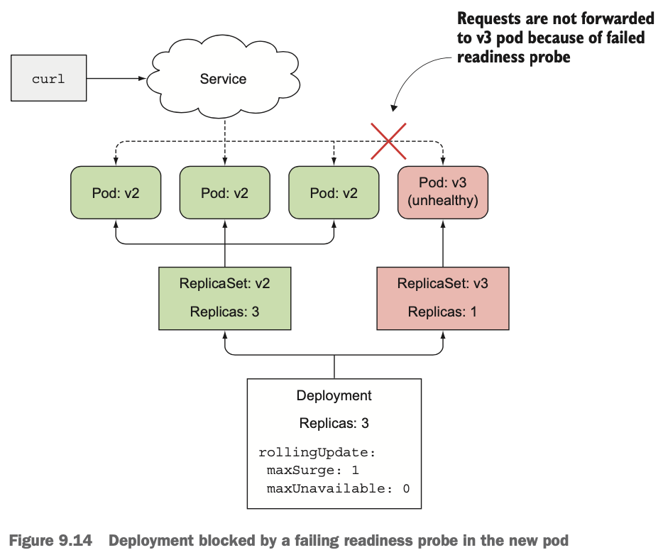

# 9장 디플로이먼트: 선언적 애플리케이션 업데이트

## 9.1 파드에서 실행 중인 애플리케이션 업데이트

- 파드를 새 버전으로 업데이트하는 방법
  - 기존 파드를 모두 삭제한 다음 새 파드 시작
    - 짧은 시간 동안 애플리케이션 사용 불가
  - 새로운 파드 시작, 기동된 후 기존 파드 삭제
    - 새 버전이 이전 버전을 손상시킬 수 있는 데이터 스키마나 데이터를 수정하면 안 됨

### 9.1.1 오래된 파드를 삭제하고 새 파드로 교체

- 레플리케이션컨트롤러의 파드 템플릿을 업데이트하여, 새 인스턴스 생성 시 업데이트된 파드 템플릿 사용


- 이전 파드가 삭제되고 새 파드가 시작되는 동안 짧은 시간의 다운타임을 허용할 경우 사용

### 9.1.2 새 파드 기동과 이전 파드 삭제

- 새 파드를 모두 기동한 후 이전 파드 삭제
- 이전 파드 삭제 시까지 두 배의 파드가 실행되므로 더 많은 하드웨어 리소스 필요

#### 한 번에 이전 버전에서 새 버전으로 전환

- 새 파드가 기동되는 동안 서비스는 이전 파드에 연결되고, 새 파드가 모두 실행되면 서비스의 레이블 셀렉터를 변경하고 새 파드로 전환(블루-그린 디플로이먼트)
- 전환 후 새 버전이 올바르게 작동하면 이전 레플리케이션컨트롤러 삭제

<aside>
ℹ️ kubectl set selector 명령어로 서비스의 파드 셀렉터 변경
</aside>


#### 롤링 업데이트 수행

- 이전 레플리케이션컨트롤러를 천천히 스케일 다운하고 새 파드를 스케일 업해 파드를 단계별로 교체
- 서비스의 파드 셀렉터에 이전 파드와 새 파드를 모두 포함하게 해 요청을 두 파드 세트로 보낼 수 있음


## 9.2 레플리케이션컨트롤러로 자동 롤링 업데이트 수행

- 수동으로 롤링 업데이트를 수행하는 대신 kubectl을 사용해 업데이트 수행 가능

### 9.2.1 애플리케이션의 초기 버전 실행

#### v1 버전의 애플리케이션 생성

```js
const http = require('http');
const os = require('os');
console.log("Kubia server starting...");
var handler = function(request, response) {
	console.log("Received request from " + request.connection.remoteAddress);
	response.writeHead(200);
	response.end("This is v1 running in pod " + os.hostname() + "\n");
};
var www = http.createServer(handler);
www.listen(8080);
```

#### 단일 YAML 파일을 사용한 애플리케이션 실행과 서비스 노출

- 애플리케이션 호출을 위해 레플리케이션컨트롤러와 로드밸런서 서비스 생성

```yaml
apiVersion: v1
kind: ReplicationController
metadata:
	name: kubia-v1
spec:
	replicas: 3
	template:
		metadata:
			name: kubia
			labels:
				app: kubia
		spec:
			containers:
			- image: luksa/kubia:v1
				name: node.js
---
apiVersion: v1
kind: Service
metadata:
	name: kubia
spec:
	type: LoadBalancer
	selector:
		app: kubia
	ports:
	- port: 80
		targetPort: 8080
```

```shell
$ kubectl get svc kubia
NAME CLUSTER-IP EXTERNAL-IP PORT(S) AGE
kubia 10.3.246.195 130.211.109.222 80:32143/TCP 5m
$ while true; do curl http://130.211.109.222; done
This is v1 running in pod kubia-v1-qr192
This is v1 running in pod kubia-v1-kbtsk
This is v1 running in pod kubia-v1-qr192
This is v1 running in pod kubia-v1-2321o
```

### 9.2.2 kubectl을 이용한 롤링 업데이트

- app.js의 다음 코드 변경

```js
response.end("This is v2 running in pod " + os.hostname() + "\n");
```

- 변경한 내용을 같은 이미지 태그로 푸시(latest 제외)하면 이미지를 이미 가져왔던 노드의 이미지는 변경되지 않고, 이미지를 가져오지 않았던 노드는 새 이미지를 가져와서 실행하므로 다른 버전의 파드가 실행될 수 있음
- imagePullPolicy 속성을 Always로 설정하여 이미지를 항상 가져오도록 설정 가능
- imagePullPolicy 속성의 기본값
  - latest 태그: Always
  - 다른 태그: IfNotPresent
- 교체할 레플리케이션컨트롤러, 새 레플리케이션컨트롤러 및 이미지를 지정하고 kubectl rolling-update 명령어를 실행하여 롤링 업데이트 수행

```shell
$ kubectl rolling-update kubia-v1 kubia-v2 --image=luksa/kubia:v2
```


- 명령어 실행 후 새 레플리케이션컨트롤러가 즉시 만들어지며, 의도하는 초기 레플리카 수는 0으로 설정됨

```shell
$ kubectl describe rc kubia-v2
Name:       kubia-v2
Namespace:  default
Image(s):   luksa/kubia:v2
Selector:   app=kubia,deployment=757d16a0f02f6a5c387f2b5edb62b155
Labels:     app=kubiaReplicas:   0 current / 0 desired
...
```

#### 롤링 업데이트가 시작되기 전 kubectl이 수행한 단계 이해하기

- kubia-v1 레플리케이션컨트롤러를 복사하고 해당 파드 템플릿에서 이미지를 변경해 새 레플리케이션컨트롤러 생성
- 새 레플리케이션컨트롤러 생성 시 이미 실행 중인 파드의 레이블을 수정하고, kubia-v1 및 kubia-v2 레플리케이션컨트롤러의 셀렉터를 변경

```shell
$ kubectl describe rc kubia-v1
Name:       kubia-v1
Namespace:  default
Image(s):   luksa/kubia:v1
Selector:   app=kubia,deployment=3ddd307978b502a5b975ed4045ae4964-orig
```

```shell
$ kubectl get po --show-labels
NAME            READY  STATUS   RESTARTS  AGE  LABELS
kubia-v1-m33mv  1/1    Running  0         2m   app=kubia,deployment=3ddd...
kubia-v1-nmzw9  1/1    Running  0         2m   app=kubia,deployment=3ddd...
kubia-v1-cdtey  1/1    Running  0         2m   app=kubia,deployment=3ddd...
```


#### 레플리케이션컨트롤러 두 개를 스케일링해 새 파드로 교체

- 새 레플리케이션컨트롤러는 스케일 업, 이전 레플리케이션컨트롤러는 스케일 다운해 파드를 하나씩 교체
- 서비스는 app=kubia 레이블이 있는 모든 파드를 대상으로 하기 때문에 요청을 반복할 때마다 새로운 v2 파드로 전달됨

```shell
This is v2 running in pod kubia-v2-nmzw9
This is v1 running in pod kubia-v1-kbtsk
This is v1 running in pod kubia-v1-2321o
This is v2 running in pod kubia-v2-nmzw9
```


- 이전 레플리케이션컨트롤러의 파드가 0으로 스케일 다운되고 마지막 파드가 삭제된 후, 레플리케이션컨트롤러 삭제

```shell
...
Scaling kubia-v2 up to 2
Scaling kubia-v1 down to 1
Scaling kubia-v2 up to 3
Scaling kubia-v1 down to 0
Update succeeded. Deleting kubia-v1
replicationcontroller "kubia-v1" rolling updated to "kubia-v2"
```

### 9.2.3 kubectl rolling-update를 더 이상 사용하지 않는 이유

- kubectl 클라이언트가 쿠버네티스 마스터 대신 스케일링을 수행해주며, 업데이트 수행중 네트워크 연결이 끊어질 경우 업데이트 프로세스가 중간에 중단될 수 있음
- 쿠버네티스에 직접적으로 파드를 추가하거나 초과된 파드를 제거하라는 실제 명령이 수행됨
  (저자는 쿠버네티스에게 의도하는 시스템 상태를 선언하고 스스로 달성하는데 중점을 두고 있음)

## 9.3 애플리케이션을 선언적으로 업데이트하기 위한 디플로이먼트 사용하기

- 애플리케이션을 배포하고 선언적으로 업데이트하기 위한 리소스
  - 디플로이먼트 생성 시 레플리카셋 리소스가 하위에 생성되며, 파드를 복제하고 관리함
  - 실제 파드는 디플로이먼트가 아닌 디플로이먼트의 레플리카셋에 의해 생성되고 관리됨


### 9.3.1 디플로이먼트 생성

- 레이블 셀렉터, 원하는 레플리카 수, 파드 템플릿으로 구성
- 디플로이먼트 리소스가 수정될 때 업데이트 수행 방법을 정의하는 디플로이먼트 전략 지정 필드가 있음

#### 디플로이먼트 매니페스트 생성

```yaml
apiVersion: apps/v1beta1
kind: Deployment
metadata:
	name: kubia
spec:
	replicas: 3
	template:
		metadata:
			name: kubia
			labels:
				app: kubia
		spec:
			containers:
			- image: luksa/kubia:v1
				name: node.js
```

<aside>
ℹ️ 최신 쿠버네티스에서는 apps/v1을 사용
</aside>

- 디플로이먼트는 여러 개의 파드 버전을 실행할 수 있으므로, 이름을 애플리케이션 버전을 참조하지 않도록 함

#### 디플로이먼트 리소스 생성

- 실행 중인 레플리케이션컨트롤러와 파드 삭제 후 디플로이먼트 생성

```shell
$ kubectl delete rc --all
$ kubectl create -f kubia-deployment-v1.yaml --record
```

<aside>
ℹ️ —record 옵션 사용 시 개정 이력에 명령어를 기록함
</aside>

#### 디플로이먼트 롤아웃 상태 출력

- kubectl get, kubectl describe 명령 외 kubectl rollout명령어를 사용해 상태 확인 가능

```shell
$ kubectl rollout status deployment kubia
```

- 디플로이먼트의 롤아웃이 성공적으로 수행되고 나면, 파드 레플리카가 시작됨

```shell
$ kubectl get po
NAME                     READY     STATUS    RESTARTS   AGE
kubia-1506449474-otnnh   1/1       Running   0          14s
kubia-1506449474-vmn7s   1/1       Running   0          14s
kubia-1506449474-xis6m   1/1       Running   0          14s
```

#### 디플로이먼트가 레플리카셋을 생성하는 방법과 레플리카셋이 파드를 생성하는 방식 이해

- 디플로이먼트에서 생성한 파드의 이름은 <디플로이먼트 이름>-<레플리카셋 해시값>-<파드 해시값>으로 이루어지며, 레플리카셋이 파드를 관리함을 뜻함

```shell
$ kubectl get replicasets
NAME               DESIRED   CURRENT   AGE
kubia-1506449474   3         3         10s
```

- 레플리카셋의 이름에도 해당 파드 템플릿의 해시값이 포함되며, 디플로이먼트는 파드 템플릿의 각 버전마다 하나씩 레플리카셋을 생성함

#### 서비스로 파드 액세스

- 레플리카셋에 의해 생성된 파드 레플리카는 이전에 생성한 서비스와 같은 레이블을 가지고 있으므로 액세스 가능

### 9.3.2 디플로이먼트 업데이트

- 디플로이먼트 리소스에 정의된 파드 템플릿을 수정하기만 하면, 쿠버네티스가 실제 시스템 상태를 리소스에 정의된 상태로 만드는 데 필요한 모든 단계 수행

#### 사용 가능한 디플로이먼트 전략

- 사용 가능한 디플로이먼트 전략
  - RollingUpdate(기본): 롤링 업데이트 전략
  - Recreate: 한 번에 기존 모든 파드를 삭제한 뒤 새로운 파드 생성

#### 데모 목적으로 롤링 업데이트 속도 느리게 하기

- minReadySeconds 속성을 설정하여 업데이트 프로세스의 속도 설정

```shell
$ kubectl patch deployment kubia -p '{"spec": {"minReadySeconds": 10}}'
```

<aside>
ℹ️ kubectl patch 명령어는 리소스 개별 속성 수정 시 유용
</aside>

#### 롤링 업데이트 시작

- 롤링 업데이트 프로세스 진행 사항을 추적하기 위해 서비스로 curl 요청 실행

```shell
$ while true; do curl http://130.211.109.222; done
```

- 롤아웃을 시작하기 위해 디플로이먼트 수정

```shell
$ kubectl set image deployment kubia nodejs=luksa/kubia:v2
```


- 시간이 지날수록 v2 파드로 요청을 보내는 것을 확인할 수 있음

#### 디플로이먼트의 놀라움

- 추가 레플리카셋이 생성되고, 순차적으로 스케일 업한 뒤, 이전 레플리카셋 크기를 0으로 스케일 다운


- 레플리카셋 조회 시 기존 레플리카셋과 새 레플리카셋이 존재

```shell
$ kubectl get rs
NAME               DESIRED   CURRENT   AGE
kubia-1506449474   0         0         24m
kubia-1581357123   3         3         23m
```

- 디플로이먼트 리소스만 조작하고 세부적인 구현은 하위의 레플리카셋이 담당

### 9.3.3 디플로이먼트 롤백

#### 애플리케이션 버전 3 만들기

```js
const http = require('http');
const os = require('os');

var requestCount = 0;

console.log("Kubia server starting...");
var handler = function(request, response) {
	console.log("Received request from " + request.connection.remoteAddress);
	if (++requestCount >= 5) {
		response.writeHead(500);
		response.end("Some internal error has occurred! This is pod " +
		os.hostname() + "\n");
    return;
	}
  response.writeHead(200);
  response.end("This is v3 running in pod " + os.hostname() + "\n");
};

var www = http.createServer(handler);
www.listen(8080);
```

#### 버전 3 배포하기

- 디플로이먼트 스펙에서 이미지를 변경해 새 버전 배포

```shell
$ kubectl set image deployment kubia nodejs=luksa/kubia:v3
```

- 롤아웃 진행 상황 확인 후 요청 실행

```shell
$ kubectl rollout status deployment kubia
Waiting for rollout to finish: 1 out of 3 new replicas have been updated...
Waiting for rollout to finish: 2 out of 3 new replicas have been updated...
Waiting for rollout to finish: 1 old replicas are pending termination...
deployment "kubia" successfully rolled out
```

```shell
$ while true; do curl http://130.211.109.222; done
This is v3 running in pod kubia-1914148340-lalmx
This is v3 running in pod kubia-1914148340-bz35w
This is v3 running in pod kubia-1914148340-w0voh
...
This is v3 running in pod kubia-1914148340-w0voh
Some internal error has occurred! This is pod kubia-1914148340-bz35w
This is v3 running in pod kubia-1914148340-w0voh
Some internal error has occurred! This is pod kubia-1914148340-lalmx
This is v3 running in pod kubia-1914148340-w0voh
Some internal error has occurred! This is pod kubia-1914148340-lalmx
Some internal error has occurred! This is pod kubia-1914148340-bz35w
Some internal error has occurred! This is pod kubia-1914148340-w0voh
```

#### 롤아웃 되돌리기

- 디플로이먼트의 마지막 롤아웃을 취소하도록 지시해서 이전에 배포된 버전으로 쉽게 롤백 가능

```shell
$ kubectl rollout undo deployment kubia
```

<aside>
ℹ️ 롤아웃 프로세스가 진행 중이더라도 롤아웃 중단이 가능하며, 이미 생성된 파드는 제거되고 이전 파드로 다시 교체됨
</aside>

#### 디플로이먼트 롤아웃 이력 표시

- kubectl rollout history 명령어로 개정 이력 표시

```shell
$ kubectl rollout history deployment kubia
REVISION    CHANGE-CAUSE
2           kubectl set image deployment kubia nodejs=luksa/kubia:v2
3           kubectl set image deployment kubia nodejs=luksa/kubia:v3
```

<aside>
⚠️ 디플로이먼트 생성 시 —record 옵션이 없는 경우 CHANGE_CAUSE가 누락됨
</aside>

#### 특정 디플로이먼트 개정으로 롤백

- undo 명령어에서 개정 번호를 지정해 특정 개정으로 롤백 가능

```shell
$ kubectl rollout undo deployment kubia --to-revision=1
```

- 디플로이먼트에서 생성한 모든 레플리카셋은 개정 내역을 나타내며, 수동으로 삭제 시 특정 버전 기록을 잃어 롤백 불가


- 디플로이먼트 리소스의 editionHistoryLimit 속성에 의해 개정 내역 수 제한(기본값: 2)

### 9.3.4 롤아웃 속도 제어

#### 롤링 업데이트 전략의 maxSurge와 maxUnavailable 속성 소개

- 디플로이먼트 strategy 속성의 rollingUpdate속성 아래 일부로 설정

```yaml
spec:
	strategy:
		rollingUpdate:
			maxSurge: 1
			maxUnavailable: 0
		type: RollingUpdate
```

- maxSurge: 디플로이먼트가 의도하는 레플리카 수보다 얼마나 많은 파드 인스턴스 수를 허용할 수 있는지 결정(기본적으로 25%로 설정되며 최대 설정 가능한 수도 25%)
- maxUnavailable: 업데이트 중에 의도하는 레플리카 수를 기준으로 사용할 수 없는 파드 인스턴스 수 결정(기본적으로 25%로 설정되며 사용 가능한 파드 인스턴스 수는 의도하는 레플리카 수의 75% 이하로 설정 불가)


#### maxUnavailable 속성 이해


- maxUnavailable 속성은 원하는 레플리카 수에 비례하기 때문에, 전체 파드 중 사용 불가한 수가 아님

### 9.3.5 롤아웃 프로세스 일시 중지

- 새로운 버전의 이미지 푸시 후 일부 파드만 교체한 뒤 정상 동작하는지 확인하기 위해 롤아웃 프로세스 중 배포 일시 중지 가능

#### 롤아웃 일시 정지

```shell
$ kubectl set image deployment kubia nodejs=luksa/kubia:v4
deployment "kubia" image updated

$ kubectl rollout pause deployment kubia
deployment "kubia" paused
```

- 하나 또는 적은 수의 이전 파드만 새 버전으로 바꾸어 카나리 릴리즈를 실행할 수 있음

#### 롤아웃 재개

```shell
$ kubectl rollout resume deployment kubia
deployment "kubia" resumed
```

#### 롤아웃을 방지하기 위한 일시 중지 기능 사용

- 일시 중지 기능을 사용하면 디플로이먼트를 업데이트 하는 것을 막을 수 있고, 디플로이먼트를 여러 번 변경하면서 필요한 모든 변경을 완료한 후 롤아웃 시작 가능

### 9.3.6 잘못된 버전의 롤아웃 방지

#### minReadySeconds의 적용 가능성 이해

- 파드가 사용 가능한 것으로 취급하기 전에 새로 만든 파드를 준비할 시간 지정
- 파드가 사용 가능할 때까지 롤아웃 프로세스는 진행되지 않음
- minReadySeconds가 지나기 전에 레디니스 프로브가 실패할 경우 롤아웃 차단

#### 버전 v3가 완전히 롤아웃되는 것을 방지하기 위한 레디니스 프로브 정의

- 실습을 위해 v2로 롤백 후 디플로이먼트에 레디니스 프로브 추가

```yaml
apiVersion: apps/v1beta1
kind: Deployment
metadata:
  name: kubia
spec:
  replicas: 3
  minReadySeconds: 10
  strategy:
    rollingUpdate:
      maxSurge: 1
      maxUnavailable: 0
    type: RollingUpdate
  template:
    metadata:
      name: kubia
      labels:
        app: kubia
    spec:
      containers:
      - image: luksa/kubia:v3
				name: nodejs
        readinessProbe:
          periodSeconds: 1
          httpGet:
						path: /
						port: 8080
```

- kubectl apply 명령어를 이용하여 디플로이먼트 업데이트

```shell
$ kubectl apply -f kubia-deployment-v3-with-readinesscheck.yaml
```

<aside>
ℹ️ kubectl apply로 디플로이먼트 업데이트 시, 레플리카 수를 변경하지 않으려면 replicas 필드 제거
</aside>

- rollout status 명령어 실행 후 새 파드가 생성된 것을 확인하면 v3 파드로 요청이 가능해야 하지만 파드가 준비되지 않아 접근 불가능

```shell
$ kubectl rollout status deployment kubia
Waiting for rollout to finish: 1 out of 3 new replicas have been updated...

$ while true; do curl http://130.211.109.222; done
This is v2 running in pod kubia-1765119474-jvslk
This is v2 running in pod kubia-1765119474-jvslk
This is v2 running in pod kubia-1765119474-xk5g3
This is v2 running in pod kubia-1765119474-pmb26
This is v2 running in pod kubia-1765119474-pmb26
This is v2 running in pod kubia-1765119474-xk5g3
...

$ kubectl get po
NAME                     READY     STATUS    RESTARTS   AGE
kubia-1163142519-7ws0i   0/1       Running   0          30s
kubia-1765119474-jvslk   1/1       Running   0          9m
kubia-1765119474-pmb26   1/1       Running   0          9m
kubia-1765119474-xk5g3   1/1       Running   0          8m
```

#### 레디니스 프로브가 잘못된 버전으로 롤아웃되는 것을 방지하는 법

- 레디니스 프로브가 매초마다 시작되고 다섯 번째 요청부터 실패
- 파드는 서비스의 엔드포인트에서 제거되고, 파드가 사용 가능한 것으로 간주되려면 10초 이상 준비되어 있어야 하기 때문에 롤아웃 프로세스는 중지됨



#### 롤아웃 데드라인 설정

- 기본적으로 롤아웃이 10분 동안 진행되지 않으면 실패한 것으로 간주

```shell
$ kubectl describe deploy kubia
Name:                   kubia
...
Conditions:
  Type          Status  Reason
  ----          ------  ------
  Available     True    MinimumReplicasAvailable
  Progressing   False   ProgressDeadlineExceeded
```

- 디플로이먼트 스펙의 progressDeadLineSeconds 속성으로 실패한 것으로 간주되는 시간 설정

#### 잘못된 롤아웃 중지

```shell
$ kubectl rollout undo deployment kubia
```

<aside>
ℹ️ extensions/v1beta1 이후 버전에서는 progressDeadlineSeconds에 지정된 시간 초과 시 롤아웃 자동 중단
</aside>