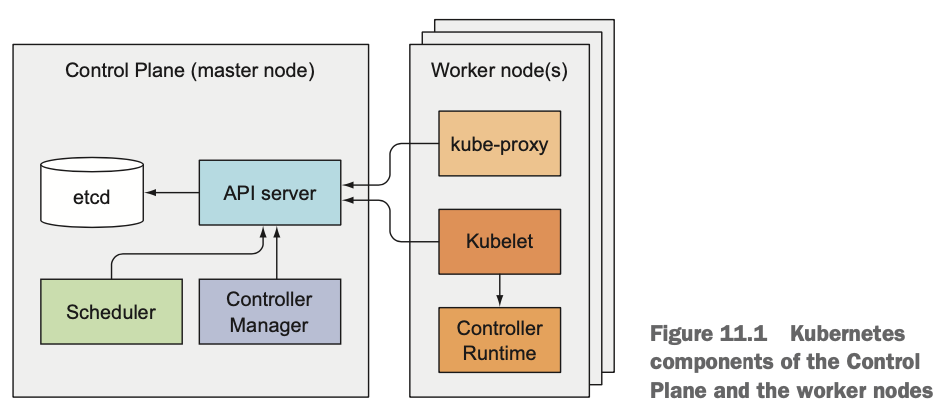
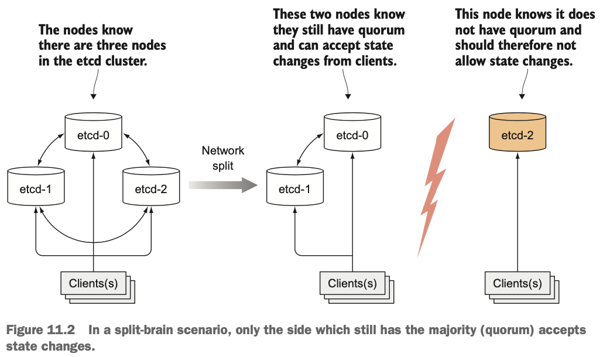
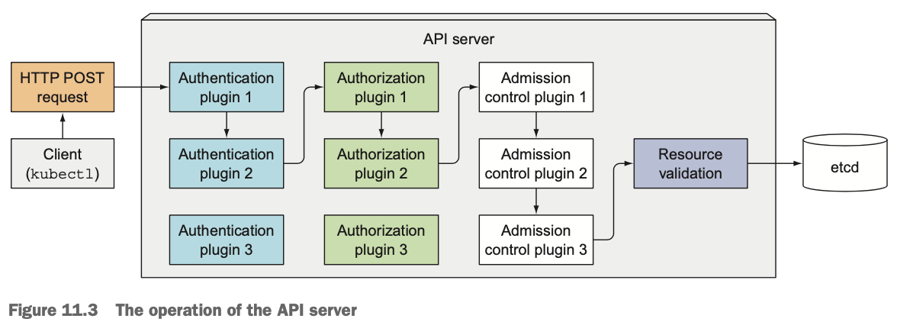
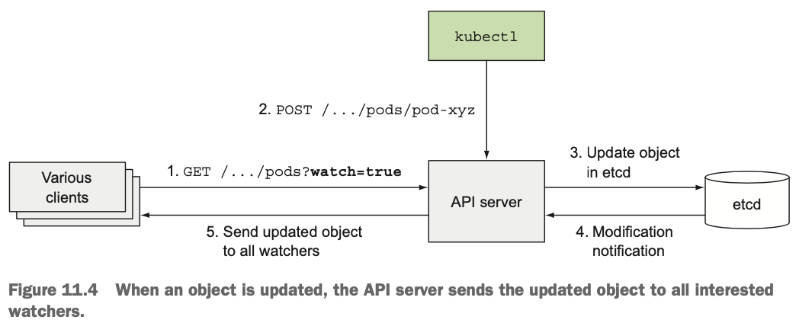
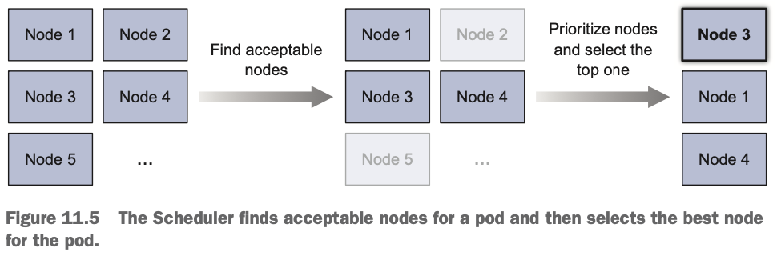
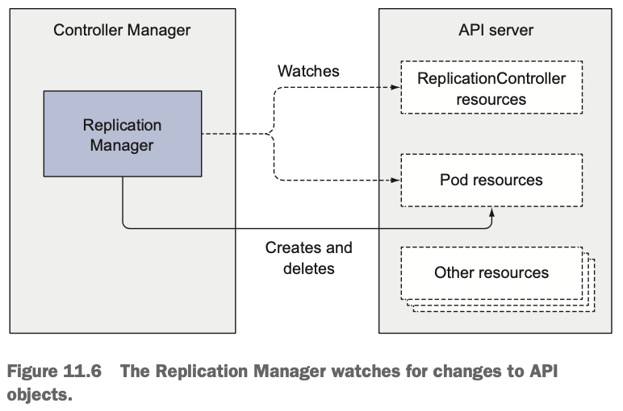
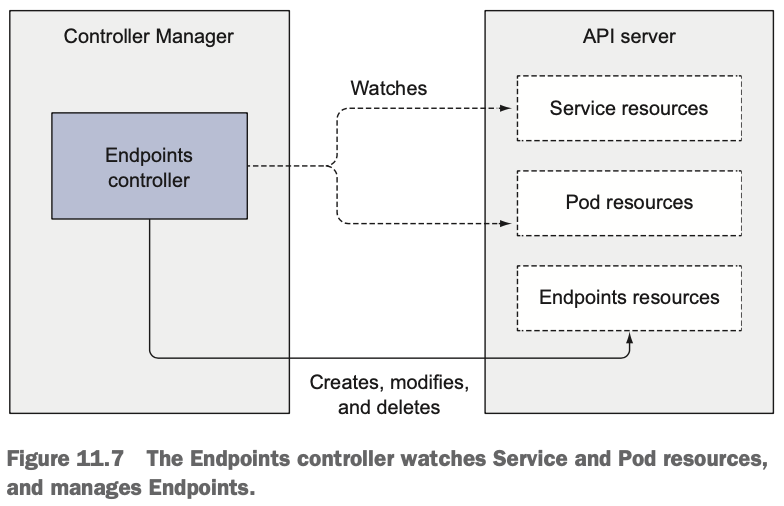

# 11장 쿠버네티스 내부 이해

# 11.1 아키텍처 이해

- 클러스터를 이루는 구성 요소
  - 쿠버네티스 컨트롤 플레인
  - (워커) 노드

#### 컨트롤 플레인 구성 요소

- 클러스터 기능을 제어하고 전체 클러스터가 동작하게 만드는 역할
- 컨트롤 플레인 구성 요소
  - etcd 분산 저장 스토리지
  - API 서버
  - 스케줄러
  - 컨트롤매니저
- 클러스터 상태를 저장하고 관리하지만 애플리케이션 컨테이너를 직접 실행하는 것은 아님

#### 워커 노드에서 실행하는 구성 요소

- 컨테이너를 실행하는 작업 담당
- 워커 노드 구성 요소
  - Kubelet
  - 쿠버네티스 서비스 프록시(kube-proxy)
  - 컨테이너 런타임(Docker, rkt 외 기타)

#### 애드온 구성 요소

- 클러스터에서 모든 기능을 제공하기 위해 필요한 추가 구성 요소
  - 쿠버네티스 DNS 서버
  - 대시보드
  - 인그레스 컨트롤러(Ingress Controller)
  - 힙스터(14장 참고)
  - 컨테이너 네트워크 인터페이스(Container Network Interface) 플러그인

### 11.1.1 쿠버네티스 구성 요소의 분산 특성

> ℹ️ 용어 정리
> </br>컨트롤플레인 = 마스터노드
> </br>구성요소 = 컴포넌트

[https://www.bluematador.com/blog/how-to-pronounce-kubernetes](https://www.bluematador.com/blog/how-to-pronounce-kubernetes)

- 모든 구성 요소들은 모두 개별 프로세스로 실행됨



- 모든 기능을 사용하기 위해서는 모든 구성 요소가 실행 중이어야 하지만, 일부는 개별적으로 작업 실행 가능

<aside>
ℹ️ API 서버는 각 컨트롤 플레인 구성 요소의 상태를 표시하는 ComponentStatus라는 API 리소스 제공

```shell
$ kubectl get componentstatuses
NAME                 STATUS    MESSAGE              ERROR
scheduler            Healthy   ok
controller-manager   Healthy   ok
etcd-0               Healthy   {"health": "true"}
```

</aside>

#### 구성 요소가 서로 통신하는 방법

- 쿠버네티스 시스템 구성 요소는 서로 직접 통신하지 않고, API 서버하고만 통신
- API 서버는 etcd와 통신하는 유일한 구성 요소
- API 서버와 다른 구성요 사이의 통신은 대부분 구성 요소에서 시작되나, 다음의 경우 API 서버가 Kubelet에 접속
  - kubectl을 이용해 로그를 가져올 때
  - kubectl attach 명령으로 실행 중인 컨테이너에 연결할 때
  - kubectl port-forward 명령을 실행할 때

<aside>
ℹ️ kubectl attach 명령은 별도 프로세스 실행 대신 컨테이너에 실행 중인 메인 프로세스에 연결(cf. kubectl exec)
</aside>

#### 개별 구성 요소의 여러 인스턴스 실행

- 컨트롤 플레인의 구성 요소는 여러 서버에 걸쳐 실행 가능
- 둘 이상의 인스턴스를 실행해 가용성 확보
- etcd와 API 서버는 여러 인스턴스를 동시에 활성화 가능(병렬)
- 스케줄러와 컨트롤러 매니저는 하나의 인스턴스만 활성화, 나머지는 대기 상태

#### 구성 요소 실행 방법

- Kubelet은 항상 일반 시스템 구성 요소로 실행
- Kubelet이 다른 구성 요소를 파드로 실행
- **컨트롤 플레인 구성 요소를 파드로 실행하기 위해 kubelet도 마스터 노드에 배포**

```shell
$ kubectl get po -o custom-columns=POD:metadata.name,NODE:spec.nodeName\
	--sort-by spec.nodeName -n kube-system
POD                              NODE
kube-controller-manager-master   master
kube-dns-2334855451-37d9k        master
etcd-master                      master
kube-apiserver-master            master
kube-scheduler-master            master
kube-flannel-ds-tgj9k            node1
kube-proxy-ny3xm                 node1
kube-flannel-ds-0eek8            node2
kube-proxy-sp362                 node2
kube-flannel-ds-r5yf4            node3
kube-proxy-og9ac                 node3
```

- 모든 컨트롤 플레인 구성 요소는 마스터 노드에서 파드로 실행됨

### 11.1.2 쿠버네티스가 etcd를 사용하는 방법

- 매니페스트를 영구적으로 저장하기 위해 빠르고, 분산해서 저장되며, 일관된 키-값 저장소를 제공하는 etcd 사용
- API 서버만 etcd와 직접적으로 통신, 다른 구성 요소는 API 서버로 간접적으로 접근
  - 강력한 낙관적 잠금 시스템, 유효성 검사 등 이점
  - 실제 저장소 메커니즘을 추상화해 다른 모든 구성 요소에 제공해 교체가 쉬움

<aside>
ℹ️ 낙관적 동시성 제어
데이터 조각에 잠금을 설정해 그동안 데이터를 읽거나 업데이트하지 못하도록 하는 대신, 데이터에 버전 번호를 포함하는 방법
모든 쿠버네티스 리소스에는 오브젝트 업데이트 시 API 서버로 전달하는 metadata.resourceVersion 필드가 있으며, etcd에 저장돼 있는 버전과 일치하지 않을 경우 API 서버는 수정 요청을 거부함
</aside>

#### 리소스를 etcd에 저장하는 방법

- etcd v3는 키 형식을 디렉터리처럼 유지(키에 슬래시 포함 가능)하기 때문에 구조가 유사
- 모든 데이터를 /registry 하위에 저장

```shell
$ etcdctl ls /registry
/registry/configmaps
/registry/daemonsets
/registry/deployments
/registry/events
/registry/namespaces
/registry/pods
...
```

<aside>
ℹ️ etcd API v3 사용 시 ls 대신 get /registry —prefix=true 사용
</aside>

```shell
$ etcdctl ls /registry/pods
/registry/pods/default
/registry/pods/kube-system
```

```shell
$ etcdctl ls /registry/pods/default
/registry/pods/default/kubia-159041347-xk0vc
/registry/pods/default/kubia-159041347-wt6ga
/registry/pods/default/kubia-159041347-hp2o5
```

```shell
$ etcdctl get /registry/pods/default/kubia-159041347-wt6ga
{"kind":"Pod","apiVersion":"v1","metadata":{"name":"kubia-159041347-wt6ga",
"generateName":"kubia-159041347-","namespace":"default","selfLink":...
```

- API 서버는 리소스의 완전한 JSON 표현을 etcd에 저장함

#### 저장된 오브젝트의 일관성과 유효성 보장

- API 서버 한곳에서 낙관적 잠금 메커니즘을 구현하여 클러스터 상태를 업데이트하기 때문에, 오류 발생 가능성을 줄이고 일관성을 가짐
- 저장소에 기록된 데이터가 항상 유효하고 데이터의 변경이 올바른 권한을 가진 클라이언트에 의해서만 수행되도록 함

#### 클러스터링된 etcd의 일관성 보장

- RAFT 합의 알고리즘을 사용해 각 노드 상태가 대다수의 노드가 동의하는 현재 상태이거나, 이전에 동의된 상태 중 하나임을 보장
- 클라이언트(API 서버)는 etcd 클러스터의 서로 다른 노드에 접속해 실제 현재 상태 또는 과거 상태 중 하나 확인
- 클러스터가 다음 상태로 진행하기 위해 과반수가 필요
  - 연결이 끊어진 두 개의 노드 그룹으로 분리될 경우
    - 이전 상태에서 새로운 상태로 전환하기 위해 필요한 과반을 확보할 수 없기 때문에 두 그룹의 상태가 달라질 수 없음
    - 한 그룹이 전체 노드의 과반을 가진다면, 과반을 가진 그룹은 상태 변경이 가능하지만 나머지 그룹은 변경 불가
    - 상태가 달라진 두 그룹이 다시 연결되면 상태 변경을 하지 못한 그룹이 상태 변경을 한 그룹의 상태를 따라감



#### etcd 인스턴스 수가 홀수인 이유

- 과반을 위해 필요한 인스턴스 수를 고려할 때, etcd는 인스턴스를 일반적으로 홀수로 배포
  - 하나의 인스턴스와 두 개의 인스턴스 비교
    - 두 개의 인스턴스일 경우 둘 중 하나라도 실패할 경우 과반을 가질 수 없음
  - 세 개의 인스턴스와 네 개의 인스턴스 비교
    - 둘 다 하나의 인스턴스 실패만 허용됨
    - **네 개의 인스턴스 중 하나가 실패할 경우, 높은 확률로 또 다른 노드가 실패할 수 있음**
- 대규모 etcd 클러스터에서는 일반적으로 5대 또는 7대 노드로 구성

### 11.1.3 API 서버의 기능

- 다른 모든 구성 요소와 kubectl 같은 클라이언트에서 사용하는 중심 구성 요소
- 클러스터 상태 조회 및 변경을 위해 RESTful API로 CURD 인터페이스 제공, etcd에 상태 저장
- 오브젝트를 etcd에 저장하는 일관된 방법 제공
- 오브젝트 유효성 검사 작업 수행을 통해 잘못 설정된 오브젝트 저장 불가
- 낙관적 잠금 처리를 통해 동시 업데이트 발생 시 다른 클라이언트에 의한 오브젝트 변경 사항 재정의 방지



#### 인증 플러그인으로 클라이언트 인증

- 요청을 보낸 클라이언트 인증을 위해 API 서버에 구성된 하나 이상의 인증 플러그인 호출
- 인증 플러그인은 클라이언트 사용자 이름, 사용자 ID, 속해있는 그룹 정보 추출 후 인가 단계에서 사용

#### 인가 플러그인을 통한 클라이언트 인가

- 요청한 리소스를 대상으로 작업을 수행할 수 있는지 확인하기 위해 API 서버에 구성된 하나 이상의 인가 플러그인 호출
- 인가 플러그인에서 사용자가 해당 작업을 수행할 수 있다고 판단되면 다음 단계 진행

#### 어드미션 컨트롤 플러그인으로 요청된 리소스 확인과 수정

- 리소스 생성/수정/삭제 요청일 경우 모든 어드미션 컨트롤 플러그인 호출
- 누락된 필드를 기본값으로 초기화하거나 재정의, 또는 요청 거부 가능
- 어드미션 컨트롤 플러그인 예시
  - AlwaysPullImages: 파드가 배포될 때마다 이미지를 항상 강제로 가져오도록 재정의
  - ServiceAccount: 명시적으로 지정하지 않을 경우 default 서비스 어카운트 적용
  - NamespaceLifecycle: 삭제 과정 또는 존재하지 않는 네임스페이스 안에 파드 생성 방지
  - ResourceQuota: 특정 네임스페이스 안에 있는 파드가 해당 네임스페이스에 할당된 CPU와 메모리만 사용하도록 강제

<aside>
ℹ️ 데이터를 읽는 요청일 경우 어드미션 컨트롤을 거치지 않음
</aside>

#### 리소스 유효성 확인 및 영구 저장

- 모든 어드미션 컨트롤 플러그인 통과 후, 유효성 검증 및 etcd 저장

### 11.1.4 API 서버가 리소스 변경을 클라이언트에 통보하는 방법 이해

- API 서버는 컨트롤러와 다른 구성 요소가 배포된 리소스 변경 사항을 관찰할 수 있도록 하는 역할만 수행
- 오브젝트가 갱신될 때마다, 오브젝트를 감시하고 있는 연결된 모든 클라이언트에 오브젝트의 새 버전 전송



- kubectl 사용 시 —watch 옵션을 이용해 오브젝트의 생성, 수정, 삭제 통보를 받을 수 있음

```shell
$ kubectl get pods --watch
NAME                    READY     STATUS              RESTARTS   AGE
kubia-159041347-14j3i   0/1       Pending             0          0s
kubia-159041347-14j3i   0/1       Pending             0          0s
kubia-159041347-14j3i   0/1       ContainerCreating   0          1s
kubia-159041347-14j3i   0/1       Running             0          3s
kubia-159041347-14j3i   1/1       Running             0          5s
kubia-159041347-14j3i   1/1       Terminating         0          9s
kubia-159041347-14j3i   0/1       Terminating         0          17s
kubia-159041347-14j3i   0/1       Terminating         0          17s
kubia-159041347-14j3i   0/1       Terminating         0          17s
```

### 11.1.5 스케줄러 이해

- API 서버의 감시 메커니즘을 통해 할당된 노드가 없는 새로운 파드를 노드에 할당
- 스케줄러는 API 서버로 파드 정의를 갱신하고, API 서버는 Kubelet에 파드 스케줄링 통보
- 대상 노드의 Kubelet이 확인 후 파드 컨테이너 생성 및 실행

#### 기본 스케줄링 알고리즘

- 모든 노드 중 파드를 스케줄링할 수 있는 노드 목록 필터링
- 수용 가능한 노드의 우선순위를 정하고 점수가 높은 노드 선택
    - 같은 최상의 점수를 가진 노드가 여러 개일 경우 라운드-로빈 사용



#### 수용 가능한 노드 찾기

- 미리 설정된 조건 함수를 사용하여 파드를 수용할 수 있는 노드를 찾음
  - 노드가 하드웨어 리소스에 대한 파드 요청을 충족시킬 수 있는지(14장 참고)
  - 노드에 리소스가 부족한지
  - 파드를 특정 노드로 스케줄링하도록 요청한 경우, 해당 노드인지
  - 파드 정의의 노드 셀렉터와 일치하는 레이블을 가진 노드인지
  - 파드가 특정 호스트 포트에 할당되도록 요청한 경우, 해당 포트가 이미 사용 중인지(13장 참고)
  - 파드가 특정한 유형의 볼륨이 필요할 경우 노드에서 해당 볼륨 마운트가 가능한지, 다른 파드가 이미 같은 볼륨을 사용 중인지
  - 파드가 노드의 테인트를 허용하는지(16장 참고)
  - 파드에 설정된 어피니티, 안티-어피니티가 있다면, 노드에 스케줄링 시 규칙을 어기는지

#### 파드에 가장 적합한 노드 선택

- 적합한 노드가 여러 개 있을 경우 라운드-로빈에 의해 스케줄링
- 또는 클라우드 인프라스트럭처를 사용할 경우 두 번째 노드를 반환해 비용 절감하는 방법도 가능

#### 고급 파드 스케줄링

- 파드의 레플리카가 여러 개인 경우, 한 노드의 스케줄링하는 것보다 가능한 많은 노드에 분산시키는 것이 이상적
- 동일한 서비스 또는 레플리카셋에 속한 파드는 기본적으로 여러 노드에 분산되며, 어피니티와 안티-어피니티 규칙을 정의해 클러스터 전체로 분산되도록 강제 가능(16장 참고)
- 특정한 요구 사항이나, 인프라스트럭처 사양에 맞게 스케줄러를 구성하거나 사용자 맞춤형 구성으로 대체

#### 다중 스케줄러 사용

- 클러스터에서 여러 개의 스케줄러 실행 가능
- 파드 정의에 schedulerName 속성에 파드를 스케줄링할 때 사용할 스케줄러 지정
- schedulerName 속성이 설정되지 않거나 default-scheduler로 설정된 파드의 경우 기본 스케줄러 사용

### 11.1.6 컨트롤러 매니저에서 실행되는 컨트롤러 소개

- 배포된 리소스에 지정된 대로 시스템을 원하는 상태로 수렴되도록 하는 구성 요소
- 컨트롤러 매니저 내 다양한 조정 작업을 수행하는 여러 컨트롤러가 실행됨
- 필요한 경우 컨트롤러를 별도 프로세스로 분할해서 목적에 맞게 구현 가능
  - 레플리케이션 매니저(레플리케이션컨트롤러 리소스의 컨트롤러)
  - 레플리카셋, 데몬셋, 잡 컨트롤러
  - 디플로이먼트 컨트롤러
  - 스테이트풀셋 컨트롤러
  - 노드 컨트롤러
  - 서비스 컨트롤러
  - 엔드포인트 컨트롤러
  - 네임스페이스 컨트롤러
  - 퍼시스턴트볼륨 컨트롤러
  - 그 밖의 컨트롤러
- 컨트롤러는 리소스를 배포함에 따라 실제 작업을 수행하는 활성화된 쿠버네티스 구성 요소

#### 컨트롤러의 역할과 동작 방식 이해

- API 서버에서 리소스가 변경되는 것을 감시하고 각 변경 작업 수행
- 실제 상태를 원하는 상태(리소스의 spec 섹션에 정의)로 조정하고, 리소스 status 섹션에 기록
- 감시 메커니즘을 이용해 변경 사항을 통보받지만, 모든 이벤트를 놓치지 않는 것을 보장할 수 없어 정기적으로 누락된 이벤트가 없는지 확인 필요
- 컨트롤러는 서로 통신하지 않고 API 서버로부터 감시 메커니즘을 통해 통보 요청

#### 레플리케이션 매니저

- 레플리케이션컨트롤러 리소스를 활성화하는 컨트롤러
- 감시 메커니즘을 통해 레플리카 수와 매칭된 실제 파드 수에 영향을 주는 변화를 수신하고, 컨트롤러가 호출돼 동작 수행



- 레플리케이션컨트롤러는 새로운 파드 매니페스트를 생성해 API 서버에 게시하고, 스케줄러와 Kubelet이 파드 스케줄링과 실행 작업 수행
- 레플리케이션 매니저는 API 서버로 파드 API 오브젝트를 조작해 작업 수행

#### 레플리카셋, 데몬셋, 잡 컨트롤러

- 레플리카셋
  - 레플리케이션 매니저와 거의 동일한 기능 수행
- 데몬셋, 잡 컨트롤러
  - 파드를 실행하지 않고, 파드를 API 서버에 게시해 Kubelet이 컨테이너를 생성하고 실행하도록 함

## 디플로이먼트 컨트롤러

- 실제 배포된 상태와 디플로이먼트 API 오브젝트에 기록된 원하는 상태가 동기화되도록 관리
- 디플로이먼트 오브젝트가 수정될 때마다 새로운 버전을 롤아웃
- 디플로이먼트 내 정의된 전략에 따라 이전 레플리카셋과 새로운 레플리카셋을 조절

#### 스테이트풀셋 컨트롤러

- 스테이트풀셋 리소스 정의에 따라 파드를 생성, 관리 및 삭제
- 각 파드 인스턴스를 위한 퍼시스턴트볼륨클레임도 인스턴스화하고 관리

#### 노드 컨트롤러

- 클러스터의 워커 노드를 기술하는 노드 리소스 관리
- 클러스터에서 실행 중인 실제 머신 목록과 노드 오브젝트 목록을 동기화
- 각 노드 상태 모니터링 및 연결이 끊어진 노드에서 파드 제거

## 서비스 컨트롤러

- LoadBalancer 유형의 서비스가 생성되거나 삭제될 때 인프라스트럭처에 로드 밸런서를 요청하고 해제

#### 엔드포인트 컨트롤러

- 레이블 셀렉터와 일치하는 파드의 IP와 포트로 엔드포인트 리스트를 계속 갱신하는 활성 구성 요소
- 서비스가 추가, 갱신되거나 파드가 추가, 갱신, 삭제될 경우 서비스의 파드 셀렉터와 일치하는 파드를 선택해 IP와 포트를 엔드포인트 리소스에 추가
- 서비스 삭제 시 엔드포인트 오브젝트 삭제



#### 네임스페이스 컨트롤러

- 네임스페이스 리소스가 삭제되면, 해당 네임스페이스에 속해 있는 모든 리소스 삭제

#### 퍼시스턴트볼륨 컨트롤러

- 퍼시스턴트볼륨클레임 생성 시 적절한 퍼시스턴트볼륨을 찾아 해당 클레임에 연결
- 요청한 접근 모드와 일치하는 퍼시스턴트볼륨을 찾아 반환
- 퍼시스턴트볼륨클레임 삭제 시 해당 볼륨 연결을 끊고, 볼륨 회수 정책에 따라 회수

#### 컨트롤러 정의

- API 서버로 API 오브젝트 제어
- Kubelet과 직접 통신하거나 어떠한 명령도 내리지 않음

### 11.1.7 Kubelet이 하는 일

#### Kubelet의 작업 이해

- 워커 노드에서 실행하는 모든 것을 담당하는 구성 요소
- Kubelet이 실행 중인 노드를 노드 리소스로 만들어서 API 서버에 등록
- API 서버를 지속적으로 모니터링해 해당 노드에 파드가 스케줄링되면, 파드의 컨테이너 시작
  - 설정된 컨테이너 런타임(도커, CoreOS의 rkt 등)에 지정된 컨테이너 이미지로 컨테이너를 실행하도록 지시
- 실행 중인 컨테이너를 모니터링해 상태, 이벤트, 리소스 사용량을 API 서버에 보고
- 컨테이너 라이브니스 프로브를 실행하는 구성 요소이며, 프로브가 실패할 경우 컨테이너 재시작
- API 서버에서 파드 삭제 시 컨테이너를 중지하고 종료된 것을 통보

#### API 서버 없이 정적 파드 실행

### 네트워크 이해하기

[https://coffeewhale.com/k8s/network/2019/04/19/k8s-network-01/](https://coffeewhale.com/k8s/network/2019/04/19/k8s-network-01/)

### Raft Algorithm?